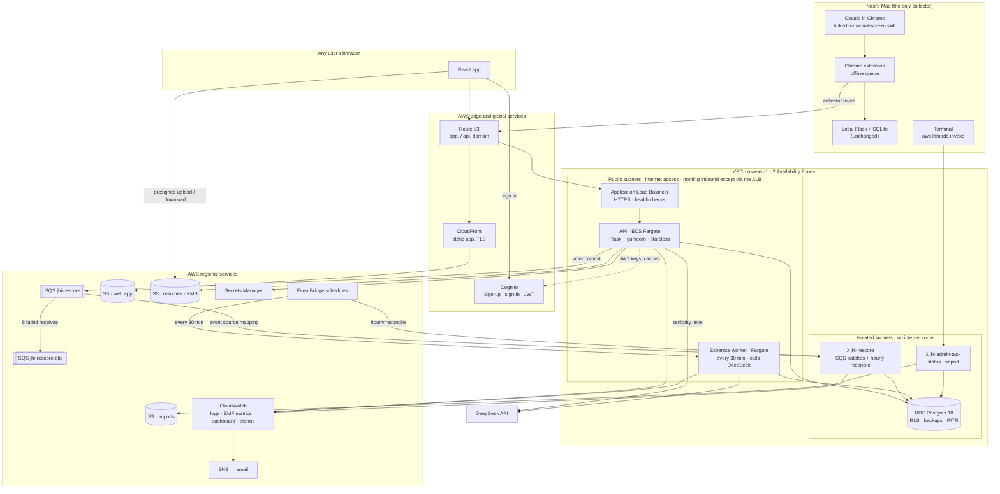
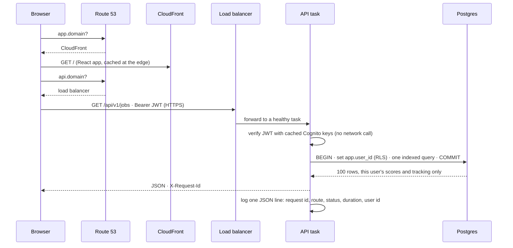
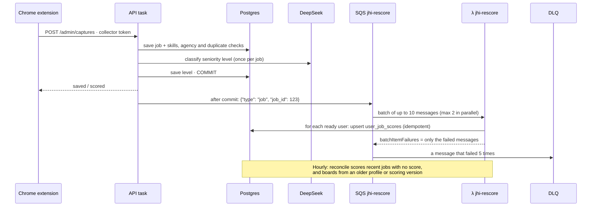
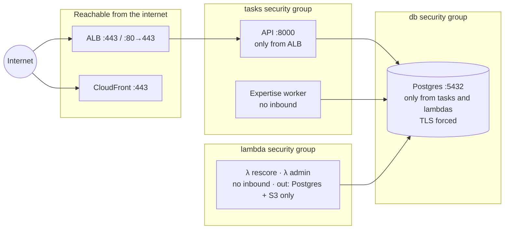
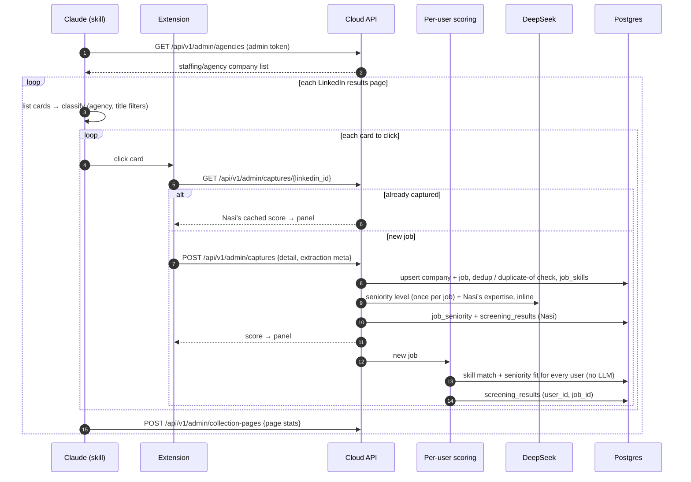

# Productization build plan: shared job board with per-user resumes, scores and tracking

Status: plan, revised 2026-09-15 (second revision: user side restored from `multi_tenant_plan.md`; seniority classified once per job; Nasi pays for LLM calls).

**Product shape.** Nasi collects jobs; the board of jobs is shared. Each user signs up, uploads a resume, enters their seniority target, and gets **their own** Skill Match and Seniority Fit on every job. Users browse the board and track their own applications. Users never run collection.

**Local stays as it is.** The local Flask server, the SQLite database (`data/job_hunt.db`), the extension flow and today's scores keep working unchanged. The cloud is built **alongside** local, never as a replacement.

**Where this comes from.**
- **Collection** (Nasi is the only collector; the extension pushes to the cloud API) is this document's design.
- **The user side** (resume ingest, a user profile with a seniority target taken from user input, per-user scores, application history) follows [`multi_tenant_plan.md`](multi_tenant_plan.md), with one change: seniority is classified **once per job** and each user's fit is computed in code, instead of a per-user prompt (§3.3). Postgres + Alembic, JWT auth and the AWS layout also still apply from there.
- **Resume parsing and skill extraction** are specified in [`resume_jd_skill_pipeline.md`](resume_jd_skill_pipeline.md). That document wins on details (package `resume/`, not `profile/`; deterministic extraction; PII redaction).

**Who pays:** Nasi pays for all LLM calls for now. Free members trigger none. Paid members trigger Expertise Match calls (§3.5).

**Tiers:** Skill Match, Seniority Fit and tracking are free. **Expertise Match is a paid-member feature** (decided 2026-09-16): a per-user profile and one LLM call per (member, job), replacing Nasi's hardcoded D/C/W prompt for members. It is an optional onboarding step: free members see it locked and skip it, and paid members fill it in or skip it (§3.5, §7).

**Out of scope:** users running collection, the AI chat widget, payment processing (an admin sets a member's plan until then).

---

## 0. Where we are today

| Piece | State |
|---|---|
| Collection | Nasi runs the `linkedin-manual-screen` skill on a local machine (Claude in Chrome drives LinkedIn). The extension captures each clicked job and `POST`s it to `http://127.0.0.1:5050/api/extension/jobs` with no auth. The API saves it and scores it immediately |
| Scoring | Skill (deterministic, reads `resume.content`), plus Seniority Fit and Expertise Match (2 DeepSeek V4 Pro calls). Tuned to Nasi's profile: "prioritizing entry-level" is hardcoded in `judge/seniority_fit.py:31`. Runs **once per job** |
| Resume | One `resume` row per track, no owner. `resume/` package (to-text, PII redaction) built and tested; not wired to storage or an endpoint |
| Dashboard | React app in `frontend/`, served at `/app/`; old page still at `/` |
| API | Flask `backend/app.py`, no auth, `CORS(app)` wide open |
| Database | One SQLite file on Nasi's machine, hand-rolled `_migrate_*` chain in `db/session.py` |
| Tracking state | `applied` / `applied_at` / `applied_resume_version` / `expired` / `not_interested` / `not_interested_note` / `note` are columns on the shared `jobs` row, so there is only room for one person's status |

---

## 1. System design

This section is the **high-level design (HLD)**: the big components, where each request goes, where data lives, what breaks first as usage grows, and how we fix it. The **low-level design (LLD)** of individual features (how a score is computed, how the score-table screen locks, which function handles a capture) lives in §3–§7 and in the code.

We build the design the way it should be reasoned about:

1. What the product must do (functional requirements).
2. How well it must do it (non-functional requirements).
3. The five sizing questions: users, read vs write, what can never be lost, latency, cost.
4. Every component, each justified by one of those answers, with its trade-offs.
5. What we deliberately left out, and the signal that would make us add it.

Status markers used below: **Built** = code and Terraform exist (`terraform/`, `cloud_api/`); **Proposed** = recommended, not built yet; **Later** = only when the stated trigger happens.

**Where each kind of compute is used.**
- **Fargate:** the API and the expertise worker. They must reach the internet (DeepSeek, Cognito) or run long requests.
- **Lambda:** the work that needs only the database. `jhi-rescore` scores boards from **SQS** messages plus an hourly reconciliation; `jhi-admin-task` runs admin commands.
- The reasoning is in §1.6, and the queue design is in §1.5.9.

### 1.1 Functional requirements (what the product does)

| # | Who | Requirement | Where |
|---|---|---|---|
| F1 | Nasi | Collect jobs from LinkedIn with the skill + Chrome extension; every capture reaches local **and** cloud | §2 |
| F2 | Nasi | Agencies and reposts are filtered before any scoring; each job's seniority level is classified once | §2, §3.3 |
| F3 | Anyone | Sign up and sign in with email | §5.1 |
| F4 | User | Upload a resume (PDF/DOCX/TXT), confirm the extracted skills | §3.1 |
| F5 | User | Pick a seniority level, then confirm or adjust the 0–5 score table | §3.3 |
| F6 | User | See the shared job board with their **own** Skill Match, Seniority Fit and total | §3.3, §6 |
| F7 | User | Track jobs (applied, not interested, notes) and application stages | §6 |
| F8 | Paid member | Expertise profile (LLM draft → edit → confirm) and per-job Expertise Match | §3.5 |
| F9 | User | Delete their account and every piece of their data | §5.3 |
| F10 | Nasi (admin) | Tokens for the extension, member plans, health | §6 |

### 1.2 Non-functional requirements (how well)

Nobody sees these in a demo, but every user feels them. Every component in §1.5 exists to meet one of these rows.

| # | Quality | Target at launch | Why this number |
|---|---|---|---|
| N1 | **Privacy / isolation** | A user can never read or change another user's resume, scores or tracking, even with a bug in a route | Resumes are PII; one leak ends the product |
| N2 | **Durability** | Resumes, profiles, tracking and application history: **never lost**, restorable to within ~5 minutes. Jobs: never lost (re-collecting costs Nasi's time). Scores: may be lost (recomputed in code) | See §1.3 Q3 |
| N3 | **Latency** | Board page p95 < **500 ms** at the API; sign-in and navigation feel instant; resume processing and expertise drafts may take seconds to ~2 min with a spinner | See §1.3 Q4 |
| N4 | **Availability** | **99.5 %** (≈ 3.6 h down a month) at launch; a database failover of 1–2 min is acceptable | Personal-scale product, no SLA; 99.9 %+ doubles the database bill |
| N5 | **Capture reliability** | No capture lost when the cloud is down; local collection never slowed by the cloud | The extension's offline queue (§2) |
| N6 | **Cost** | Under **~$100/month** of AWS at launch, plus DeepSeek | Nasi pays; no revenue yet |
| N7 | **Operability** | One person can run it: no servers to patch, deploys from `git push`, alarms by email | No ops team |
| N8 | **Security** | HTTPS everywhere, least-privilege roles and token scopes, no secrets in code or state, database not reachable from the internet | Public repository, PII |
| N9 | **Observability** | Any user-visible failure (errors, slow board, scores not updating, uploads failing, LLM failing, isolation violations) raises an email alarm within ~15 minutes, and one request id leads from the alarm to the log line | One person operates it; problems must find the operator, not the other way round |
| N10 | **Freshness** | A captured job shows up scored on every user's board within ~1 minute (at most ~1 hour if a message is lost); a profile change rescores the board within ~1 minute | Users act on the board daily |

These requirements fight each other, and the design picks sides deliberately: we accept a 1–2 minute database failover (N4) to stay inside the cost target (N6), and we accept slower background scoring to keep per-user LLM cost at zero on the free tier.

### 1.3 The five sizing questions

**Q1. How many users, how fast growing?**
Launch with Nasi plus a handful of invited users; plan for **1,000 registered users** within a year and design so **10,000** needs configuration changes, not a rewrite. Collection is one person: ~**450 new jobs on a collection day**, ~2,500/week (measured Sep 3–15, 2026). The corpus today is **15,231 jobs** (119 MB in Postgres, average posting 5.5 KB of text, ~8 skill rows per job).

**Q2. Read-heavy or write-heavy?**
Two very different paths:

- **User path is read-heavy.** A user opens the board and filters it many times; they write rarely (a tracking click, a resume every few months). Estimate at 1,000 daily users × 20 board loads ≈ 20,000 reads/day ≈ 0.25 requests/s on average, ~3 requests/s at peak. Small for Postgres.
- **Scoring path is write-heavy and fans out.** Every new job is scored for every user: 450 jobs × 1,000 users = **450,000 score rows written per collection day**, all in the background. Every new user or resume change rewrites that user's whole board (~15,000 rows, 14 s measured).

So the design effort goes into (a) keeping board reads fast with the right index, and (b) keeping the fan-out writes off the request path and bounded in size (§1.5.9).

**Q3. What can never be lost, and what can?**

| Data | Can we lose it? | Consequence for the design |
|---|---|---|
| Resume files and text | Never | S3 (11 nines durability) + KMS; encrypted text in Postgres with backups |
| Profiles, score tables, tracking, application history | Never | Postgres with automated backups + point-in-time restore |
| Jobs, companies, skills, seniority levels | Must not (expensive to re-collect and re-classify) | Same backups; the local SQLite stays a second copy |
| Per-user scores | Yes | Recomputed in code from stored data; no special protection |
| Captures waiting in the extension queue | Must not | Browser storage until the cloud acknowledges |
| Cached anything | Yes | By definition |

**Q4. How much latency can we afford?**
The board must feel instant (N3). Uploading a resume "feels like work", so users accept a few seconds of processing. An expertise draft is an explicit "draft from my resume" action and may take ~2 minutes with a spinner. Scoring after a capture is invisible to users and may take minutes.

**Q5. What does it cost?**
Every box below has a monthly price in §1.8. The rule: the right design meets Q1–Q4 for the least money, so anything not required by an answer above is in §1.7 (left out, with a trigger to add it).

### 1.4 The whole picture

#### Diagram A — components and where they run



#### Diagram B — a user opens their board



#### Diagram C — a capture becomes scores on every board



#### Diagram D — security boundaries



Inside the database, a second set of boundaries: each login has a role that can touch only its own tables (§1.5.7). Inside the API, a third: user routes see only the caller's rows (row-level security), and API tokens are limited by scope (§1.5.6).

### 1.5 Components: why each exists, and what it costs us

Each component follows the same template: **what it is · why we need it (which requirement) · how we use it · trade-offs · alternatives we rejected**.

#### 1.5.1 Architecture style: a modular monolith plus workers — Built

**What.** One Python codebase and one Docker image. The same image runs as the API (`gunicorn cloud_api.wsgi:app`), the rescore worker, the expertise worker and the migration step; only the command differs.

**Why.** One developer (N7). A monolith has one place to deploy, test and debug, and its modules call each other as functions, not over a network that can fail. The pieces that genuinely behave differently (slow LLM work, fan-out scoring) are already split out as **workers**, which is the "monolith with a few satellites" most real companies run.

**Inside the monolith, boundaries still matter:** `cloud_api/user_data.py` is the only module allowed to touch per-user tables (an AST test enforces it), admin routes and user routes use different database roles, and scoring lives in `analysis/`, independent of Flask.

**Trade-offs.** One bad deploy can break every route at once (mitigated by tests in CI, health checks and automatic rollback, §1.5.4). All routes scale together: if the board needs 10 tasks, admin routes get 10 too (cheap at our size).

**Rejected: microservices** (separate upload, board, scoring, auth services). They pay off with independent scaling needs and many teams. We have neither; we would buy network calls, distributed debugging and several deploy pipelines for no user-visible gain.

**Trigger to split something out:** one part needs a different scaling shape or runtime (e.g. resume parsing needing much more memory, or a public read API with 100× the traffic of the rest).

#### 1.5.2 DNS and certificates: Route 53 + ACM — Built

**What.** Route 53 hosts the domain; `api.<domain>` points at the load balancer and `app.<domain>` at CloudFront (alias records, free queries). AWS Certificate Manager issues and auto-renews the TLS certificates.

**Why.** Users type names, not IP addresses, and the load balancer's addresses change; an alias record follows them automatically. HTTPS (N8) needs a certificate for a name we own: resumes and sign-in tokens must never travel as readable text.

**Trade-offs.** ~$0.50/month per hosted zone plus the domain (~$14/year). DNS changes can take minutes to propagate. Certificates for CloudFront must be issued in us-east-1 (we run there anyway).

**Rejected:** buying the domain elsewhere and managing DNS by hand (works; Terraform supports it with manual records, but every change becomes a manual step).

#### 1.5.3 Web app delivery: S3 + CloudFront (CDN) — Built

**What.** The React build (HTML, JS, CSS, images) sits in a **private** S3 bucket. CloudFront serves it from edge locations near the user, over HTTPS, with origin access control so the bucket is never public. Unknown paths return `index.html` (single-page app routing).

**Why.** The app's files are identical for everyone and change only on deploy: the perfect thing to cache at the edge (N3). CloudFront also absorbs traffic spikes for free-tier-level cost and adds security headers.

**How it stays fresh.** Every deploy uploads the new build and invalidates the CloudFront cache; Vite puts a content hash in asset file names, so browsers never mix old and new files.

**Trade-offs.** Invalidations take a minute or two to reach every edge. Caching is only for the **static app**: API responses and resumes are never cached at the CDN (they're per user and private).

**Rejected:** serving the React files from the API containers (wastes API capacity on static files, slower for distant users), S3 static website hosting without CloudFront (HTTP only, public bucket).

#### 1.5.4 Load balancer: Application Load Balancer — Built

**What.** An internet-facing ALB across two Availability Zones. It terminates HTTPS, redirects HTTP → HTTPS, and forwards requests to API tasks registered in a target group.

**Why.**
- **Horizontal scaling needs a traffic officer.** With 2+ API tasks, something must decide which task answers each request.
- **Health checks** (N4). Every 30 s the ALB calls `GET /healthz` on each task; a task that stops answering stops receiving traffic within seconds, so users don't see its errors. During a deploy, the new task only receives traffic once healthy; if it never becomes healthy, ECS rolls back.
- **One stable HTTPS endpoint** while tasks come and go.
- **Security.** The API tasks accept connections **only** from the ALB's security group; the ALB drops malformed headers.

**Settings that matter.**
- Idle timeout **180 s**, because an expertise draft can take ~100 s.
- Routing algorithm: round robin today. **Least outstanding requests** is a one-line change once we run several tasks and long requests (drafts) start to pile up on one of them.
- Deregistration delay 30 s so in-flight requests finish during deploys.

**Trade-offs.** ~$16–20/month even when idle, the single largest fixed cost. The ALB itself is managed and multi-AZ, so it is not our single point of failure.

**Rejected:**
- **API Gateway + Lambda for the API.** Cheaper when idle, but its ~30 s request limit breaks expertise drafts, and a Lambda in the VPC needs a NAT gateway (~$32/month) to reach DeepSeek and Cognito (§1.6).
- **App Runner.** Simplest, but its VPC egress also requires NAT to reach the internet.
- **NGINX on EC2.** A server to patch (N7).

#### 1.5.5 API compute: ECS on Fargate, stateless — Built

**What.** The Flask app in gunicorn (2 processes × 4 threads) in a Fargate task (0.5 vCPU, 1 GB, arm64/Graviton). ECS keeps the desired number of tasks running, replaces crashed ones, and does rolling deploys with a circuit breaker that rolls back automatically.

**Why Fargate.**
- No servers to patch (N7), unlike EC2.
- **No request time limit** (expertise drafts, resume processing), unlike Lambda behind API Gateway.
- **Long-lived database connections** (a small pool per task) instead of a connection per invocation, so no RDS Proxy needed.
- Runs in public subnets with a public IP but **no inbound rules except from the ALB**, which lets tasks call DeepSeek and Cognito **without a NAT gateway**. The price is ~$3.65/month per public IPv4 address.

**Stateless by design** (the rule that makes horizontal scaling work):

| State | Where it lives | Not on the task because… |
|---|---|---|
| Who is signed in | The **JWT** the browser sends on every request, signed by Cognito | Any task can verify it with Cognito's public keys; no session store needed |
| User data, scores, tracking | Postgres | Survives task replacement |
| Resume files | S3 | Same |
| Secrets | Secrets Manager, injected at start | Never in the image |
| Cognito public keys | In-memory cache, refreshed hourly | Safe to lose: re-fetched on demand |

Ask of any data: *"if this task vanished right now, would a user lose something?"* Today the answer is no, so tasks are disposable: ECS can kill, replace or add one at any time.

**Scaling.**
- **Vertical first:** 0.5 → 1 → 2 vCPU is a one-line Terraform change and no code change.
- **Horizontal next:** raise `api_desired_count`, or add ECS target-tracking autoscaling on CPU (~60 %) and ALB requests per target.
- One task comfortably covers the launch estimate (~3 requests/s at peak).

**Trade-offs.**
- One always-on task costs ~$15/month idle.
- Starting a new task takes ~30–60 s, so autoscaling reacts in minutes, not milliseconds.
- One task means a crash is a brief outage until ECS replaces it (~1 min). Running two tasks across AZs (+$15) removes that; do it once real users depend on the board daily.

#### 1.5.6 Authentication: Amazon Cognito — Built

**What.** A Cognito user pool with email sign-up and verification, a hosted sign-in page, and an app client using the authorization-code flow. The React app receives an **ID token (JWT)**; the API verifies its signature, issuer, audience and expiry, and reads `sub` (the only identity input) and the verified email.

**Why.**
- Password storage, email verification, account recovery and brute-force protection are hard to build safely (N8).
- Cognito is free up to its monthly-active-user free tier.
- JWTs keep the API **stateless** (§1.5.5).
- It plugs into AWS without another vendor.

**Trade-offs.**
- The hosted UI is plain; a custom UI with the Amplify library takes more work.
- Cognito's built-in email sender is limited to about **50 emails/day**. Before open sign-up at scale, switch it to **SES** (few cents per thousand emails, needs domain verification).
- Moving users out of Cognito later is painful: password hashes can't be exported, so users would reset passwords.

**Rejected:**
- Rolling our own auth (risk).
- Auth0 / Clerk (nicer UX, another bill and vendor).

**Machine access: scoped API tokens.** The Chrome extension can't do a browser sign-in in the middle of a collection run, so it sends a long-lived API token.
- **Storage:** tokens are random, shown once, stored only as a SHA-256 hash, revocable, and valid only while their owner is an admin.
- **Scopes limit what a token can do:**

| Scope | Allowed routes | Used by |
|---|---|---|
| `collector` | send captures, cached lookup, agency list, collection stats, expire a job | The extension and the skill |
| `admin` | the above, plus member plans | Scripts, if ever needed |
| *(no token)* | create or revoke tokens | Only a signed-in admin person |

- **Why:** a token lives in the browser extension on one laptop. If it leaks, the damage is limited to adding jobs, not changing plans or minting more tokens.
- **Monitoring:** every denied use is counted (`TokenScopeDenied`) and alarmed.

#### 1.5.7 Database: Amazon RDS for PostgreSQL — Built

**Why SQL (derived from the access patterns, not from habit).** Our data is **structured** (every job, score and tracking row has the same fields) and **relational**: the most common query joins jobs with the caller's scores and tracking, and filters on company, level and status. We need **transactions** (a profile change writes a new profile version and its score table together or not at all; account deletion removes every per-user row at once) and **constraints** (one score row per user and job; valid seniority levels). Postgres also gives us **row-level security**, which is the strongest isolation layer we have (N1).

**Access patterns and the index that answers each:**

| Access pattern | Frequency | Query shape | Index |
|---|---|---|---|
| My board, best matches first | Very high | `user_job_scores WHERE user_id = ? ORDER BY total_score DESC` joined to jobs, tracking | `ix_user_job_scores_user_total (user_id, total_score)` |
| My score for one job / upsert score | High (worker) | `(user_id, job_id)` | `uq_user_job_scores_user_job` |
| Have we captured this LinkedIn job? | Every capture | `jobs.job_id = ?` | `ix_jobs_job_id` |
| Skills of a job | Every scoring | `job_skills.job_id = ?` | `uq_job_skill (job_id, skill_name)` |
| My tracking / applications | Medium | `(user_id, job_id)`, `user_id` | `uq_job_tracking_user_job`, `ix_application_events_user_job` |
| Sign-in | Every request | `users.idp_subject = ?` | unique constraint |
| Ready users (to score a new job for) | Every rescore message | latest `user_profiles` version per user joined to confirmed `resumes` | `uq_user_profiles_user_version (user_id, version)` |
| Is this board stale? (reconciliation) | Hourly, per user | `user_job_scores WHERE user_id = ? AND (profile_version <> ? OR scoring_version <> ?) LIMIT 1` | `uq_user_job_scores_user_job` (leading `user_id`) |

Rule we follow: **don't guess indexes.** These exist because the queries exist. When CloudWatch/Performance Insights shows a slow query, add the index that query needs, and remember each index slows every write to that table (the score table takes ~450,000 writes per collection day at 1,000 users).

**How we run it.**
- `db.t4g.micro`, 20 GB gp3 storage that grows automatically to 100 GB.
- Encrypted at rest; TLS forced (`rds.force_ssl=1`).
- In isolated subnets with no internet route; the security group accepts only the API and worker tasks.
- The owner password is managed by RDS in Secrets Manager.

**Isolation layers inside the database (N1):**
1. **Access layer:** only `user_data.py` touches per-user tables.
2. **Row-level security:** every per-user query is filtered by the transaction's `app.user_id`, so a forgotten `WHERE` returns nothing instead of someone else's data.
3. **Separate database roles:**
   - `jhi_app` (user requests) can read shared job tables but never write them.
   - `jhi_admin_api` (captures) can write jobs but can't read any per-user table.
   - The owner role runs only migrations and workers.

**Durability (N2) — replicas are not backups.**
- **Automated backups** (7 days) with **point-in-time restore** to within ~5 minutes. This is what saves us from a bad `DELETE`, which a replica would copy within milliseconds.
- A final snapshot is taken if the instance is ever deleted, and deletion protection is on.
- **Proposed:** a weekly AWS Backup copy to a second region or account (~$1–2/month). This protects against an account-level mistake.

**Availability (N4).**
- Single-AZ at launch. If the instance or its AZ fails, RDS recovers it, but that can take minutes, and restoring from backup takes longer.
- **Later — Multi-AZ** (trigger: users rely on it daily, or we promise uptime). RDS keeps a synchronous standby in another AZ and **fails over automatically in ~1–2 minutes**, with no data loss.
  - Cost: doubles the instance price (~+$14/month at micro size).
  - The standby does **not** serve reads.

**Trade-offs of this choice.**
- A single primary is a single point of failure for writes until Multi-AZ.
- `t4g` instances run on CPU credits: sustained heavy scoring can exhaust them, and the `db-cpu` alarm warns us. The fix is the next instance size (vertical scaling first).
- Rejected: **Aurora Serverless v2**, which scales automatically and fails over faster but has a higher minimum cost (~$45+/month) than a micro instance.
- Rejected: **DynamoDB**. It is excellent at single-key lookups at enormous scale, but our core queries are joins and filters across jobs, scores and tracking. Every new board filter would need a new pre-built index, and we would lose row-level security and transactions across tables.

#### 1.5.8 Object storage: S3 for resumes — Built

**What.** One private bucket, keys `users/<user_id>/…`, encrypted with a customer-managed **KMS** key, TLS-only bucket policy, public access blocked.

**How a resume moves.**
1. The API issues a **presigned POST** (5 minutes, max 5 MB, KMS encryption required by the upload policy).
2. The browser uploads straight to S3; the file never passes through the API.
3. The API then reads it, extracts text, redacts PII, and stores the encrypted text and skills in Postgres.
4. Downloads use a **presigned GET** that expires after 5 minutes.
5. Deleting an account deletes the user's prefix.

**Why.**
- Files don't belong in the database: S3 is built for durable large objects, costs ~$0.023/GB-month, and replicates across AZs automatically (N2).
- Presigned URLs keep uploads off our servers (N3, N6) and are the industry-standard way to give a browser temporary access to one private object.
- KMS adds an audit trail and key-level control on top of S3's default encryption.

**Trade-offs.**
- A presigned link works for anyone who has it until it expires (5 minutes, single object).
- Account admins can still read files: KMS protects against outsiders, not against the account's own administrators. The CI deploy role is explicitly **denied** access to resume files.
- Versioning is off on purpose, so a deleted resume is really gone (privacy over undo).

**Account deletion (F9).**
- `DELETE /api/v1/me` removes the user's S3 prefix, then the users row. Postgres removes every per-user row with it (`ON DELETE CASCADE`): resumes and their encrypted text, profiles, scores, tracking, application history, expertise profiles and scores, tokens.
- A test walks every table that has a `user_id` column, so a per-user table added later can't be forgotten.
- Logs never contain resume text or emails, only ids.
- **Stated retention:** automated database backups keep deleted data for up to **7 days**, until they expire. Messages already in SQS for a deleted user are dropped as "target missing".

**Rejected:**
- Storing files in Postgres (bloats backups, slows the database).
- Serving resumes through CloudFront (a CDN caches copies at the edge; private per-user documents should not be cached).

#### 1.5.9 Background work: SQS + Lambda, with an hourly reconciliation — Built

**The problem.** A capture must answer the extension quickly, but it creates work for every user (§1.3 Q2): one job × 1,000 users = 1,000 score rows. A profile change rewrites a user's whole board (~15,000 rows, ~14 s). Doing either inside the request makes requests slow, and makes them fail when scoring fails.

**The design (Diagram C).**
1. **Publish after commit.** The API route does its database work. Once the transaction **commits**, the API sends one message to the **SQS queue `jhi-rescore`**:
   - `{"type": "job", "job_id": …}` after a capture
   - `{"type": "user", "user_id": …}` after a level, score-table or skills change

   A request that rolls back publishes nothing, so no message ever refers to unsaved work.
2. **Consume in batches.** SQS triggers the **`jhi-rescore` Lambda** with up to 10 messages at a time, at most 2 runs in parallel (this caps database connections). Each message is scored in its own transaction:
   - a job message scores that job for every user with a confirmed resume
   - a user message rescores that user's whole board
3. **Retry only what failed.** The Lambda returns the ids of failed messages (`ReportBatchItemFailures`). Only those become visible again (after 12 minutes) and retry.
4. **Dead-letter queue.** A message that fails **5 times** moves to `jhi-rescore-dlq` (kept 14 days), and an alarm fires. After fixing the cause, redrive it back to the main queue from the console.
5. **Hourly reconciliation (the safety net).** EventBridge invokes the same Lambda with `{"type": "reconcile"}`. For every ready user it:
   - rescores the whole board if their scores come from an older **profile version** or an older **scoring logic version**
   - scores any job from the last 3 days that has no score for them, and reports how old the oldest such job was (`UnscoredJobAgeMinutes`)
6. **The app knows when scoring has caught up.** `GET /api/v1/me` returns `onboarding.board_scored`. The app shows "scoring your board…" until the current profile version has scores.

**Why this is safe with an at-least-once queue.**
- **Duplicates:** SQS may deliver a message twice. Scoring is an **upsert** keyed by `(user, job)`, so a second run rewrites the same row with the same values. No FIFO queue or deduplication table is needed.
- **Publish failures:** if SQS is unreachable right after a commit, the request still succeeds. The failure is logged and counted (`RescorePublishFailed`, alarmed), and the hourly reconciliation scores the work.
- **Stale data:** every score row records the profile version and `scoring_version` that produced it. Changing the scoring code means bumping one constant, and reconciliation recomputes every board.
- **Deleted targets:** a message for a job or user that no longer exists is acknowledged and logged, not retried.

**Why SQS rather than a Postgres queue table** (the first version used one):
- Retries with backoff, per-message failure handling and a dead-letter queue come built in.
- Queue depth and age of the oldest message are free CloudWatch metrics.
- Scoring starts within seconds instead of waiting for a 5-minute poll.
- The Lambda scales with the queue, capped by maximum concurrency.
- Cost stays under ~$1/month at this volume.

**Why Lambda for the consumer.**
- It needs only the database.
- The Lambda service polls SQS on the function's behalf, so the function stays in the isolated subnets with no internet access.
- It signs in with IAM database authentication as the narrow `jhi_scorer` role: reads jobs, profiles and confirmed resume skills; writes scores; nothing else.

**Trade-offs.**
- Two paths to understand: the queue normally, and reconciliation after a failure. Worst-case freshness after a lost message is about an hour.
- `save_new_job` (shared with the local app) commits on its own, so a capture is not one single transaction. Publishing after the final commit handles this: a job saved before a later failure is picked up by reconciliation.
- Messages expire after 4 days (DLQ: 14). An ignored DLQ alarm eventually loses those messages, but reconciliation still recovers the scores.
- A Lambda run is capped at 2 minutes. A single user's full rescore takes ~14 s today; at much larger boards, a user message would need splitting into pages.

**Rejected:**
- Scoring inside requests: slow, and fails with the request.
- A Postgres queue table: works, but we would rebuild retries, a DLQ and metrics by hand.
- A transactional outbox with a relay process: stronger delivery guarantees, but one more moving part. Reconciliation gives the same end result for a workload whose messages are idempotent.

**Scaling the fan-out (the part that will actually grow).**
- `user_job_scores` grows as **users × jobs**. At 1,000 users and ~180,000 jobs a year that is ~180 M rows (~90 GB with the stored matched/missing skill lists), far larger than everything else combined.
- **Proposed** plan, cheapest first:
  1. Score only **active** jobs (not expired, seen in the last ~60 days): ~27 M rows, ~13 GB at 1,000 users.
  2. Store only the numbers per row; compute matched/missing skill lists **on demand** for the one job a user opens.
  3. **Later:** partition `user_job_scores` by `user_id` hash.
  4. **Later:** score **on read** for users inactive for N days, instead of on every capture.
  5. Only after all of that: sharding (§1.7).

#### 1.5.10 Scheduling: EventBridge — Built

**What.** EventBridge rules:
- **every hour**, invoke the `jhi-rescore` Lambda with `{"type": "reconcile"}`
- **every 30 minutes**, start the expertise worker's Fargate task

New captures and profile changes don't wait for a schedule: they arrive through SQS (§1.5.9).

**Why.** Managed cron with IAM permissions and no always-on scheduler process (N7).

**Trade-offs.**
- At-least-once invocation: a run may occasionally start twice. Reconciliation and expertise scoring both skip work that is already done, and score writes are upserts.
- **Later:** EventBridge **Scheduler** (the newer service) if we need time zones or one-off schedules.

#### 1.5.11 LLM calls: DeepSeek, outside AWS — Built

**Where LLM calls happen and who pays:**

| Call | When | Volume | Path |
|---|---|---|---|
| Seniority level | Once per new job, during capture | ~450/collection day | Capture request (the extension doesn't wait for it) |
| Expertise draft (paid) | Member clicks "draft" | ≤ 3/member/day | API request, up to ~100 s |
| Expertise match (paid) | Worker | ≤ 50/member/run | Background |

**Why these boundaries.**
- **Free-tier users never trigger an LLM call** (rule 5 below), so cost scales with collection, not with users.
- The paid calls are capped per member.
- A failed seniority call never fails the capture: the job is saved and classified later.

**Trade-offs.**
- A third-party dependency outside AWS: an outage means new jobs arrive without a level (scored "unknown" until reclassified).
- Spend limits must be set in DeepSeek's console, because AWS Budgets can't see that bill.
- **Later:** Amazon Bedrock would keep calls and billing inside AWS, but needs a re-evaluation against the tuned gold sets before switching.

#### 1.5.12 Secrets: Secrets Manager + IAM roles — Built

**Why.**
- The repository is public (N8).
- Nothing secret may live in code, images, Terraform state or environment files.
- ECS injects secrets into containers at start.
- Generated passwords are written with Terraform's **write-only** attributes, so they never appear in state or plans.

**Trade-offs.**
- ~$0.40/secret/month (5 secrets).
- Rotating the API logins' passwords is manual today. RDS rotates only the owner password it manages.

**Rejected:** SSM Parameter Store SecureString. It's cheaper (free standard tier) and would work, but it lacks the RDS-managed-secret integration.

#### 1.5.13 Networking: VPC without NAT — Built

**Layout.**
- Two public subnets (ALB, API, expertise worker) and two isolated subnets (RDS and both Lambda functions), across two Availability Zones.
- The Lambdas' security group allows no inbound traffic and only two ways out: Postgres (port 5432) and S3 (through the gateway endpoint). A test fails if either Lambda ever gets a route to the internet.
- SQS doesn't need a network path from the rescore Lambda: the Lambda service reads the queue and passes messages to the function. The API publishes to SQS over its public IP.
- A free S3 **gateway endpoint** lets private components reach S3 without the internet.

**Why no NAT gateway.**
- NAT would cost ~$32/month plus data per AZ, which is a third of the launch budget.
- Tasks that need the internet get public IPs with **no inbound rules**, which is equally closed to the internet.
- Components that don't need the internet sit in isolated subnets.

**Trade-offs.**
- Anything placed in an isolated subnet can reach only the database and S3, unless we add interface endpoints (~$7/month each) or NAT. That shapes where each future component may run (§1.6).
- Public IPv4 addresses cost ~$3.65/month each.
- **Considered: API and worker tasks in private subnets** (design review, 2026-09-17). It would add defense in depth if a security-group rule were ever misconfigured, but needs a NAT gateway (~$32+/month) for DeepSeek and Cognito. Inbound exposure today is the same (nothing but the ALB can reach a task), and the Terraform tests guard the rules. Revisit when revenue or compliance justifies the NAT cost (§1.7).

#### 1.5.14 Admin access to the private database — Built (Lambda) / Proposed (port forwarding)

The admin role can **manage** RDS through the AWS API (snapshots, sizing) but can't **connect** to port 5432 from a laptop. That is intended: the database has no public address. Two approved ways in:

- **`jhi-admin-task` Lambda** (Built): a fixed list of named commands, never arbitrary SQL, invoked from a terminal with `aws lambda invoke`. IAM decides who may call it, and it signs in as the narrow `jhi_importer` role (shared job tables only, no per-user tables).
  - `status`: job count, jobs in the last 24 h, jobs with a seniority level. Queue depth is on the dashboard (SQS metrics).
  - `import_sqlite`: the one-time seed. Upload a copy of the local SQLite file to the private imports bucket (`imports/…`, auto-deleted after a day), invoke the command. It copies the shared tables into the empty cloud database, **leaves out Nasi's private tables** (`resume`, `career_goals`, `chat_messages`) and deletes the upload.
- **Session Manager port forwarding through an API task** (Proposed): `psql` on the Mac connects to `localhost:15432`, tunneled via ECS Exec. Nothing opens to the internet, access is IAM-controlled and logged, and there's no bastion server to patch.

#### 1.5.15 Observability — Built

**Goal (N9).** Problems find the operator: any user-visible failure raises an email alarm within ~15 minutes, and a request id leads from the alarm to the exact log line. All of it stays inside CloudWatch: no agent, no extra vendor, ~$5–10/month.

**1. Structured logs.** Every component writes one JSON object per line to stdout; ECS and Lambda ship it to CloudWatch Logs (30 days).
- **API:** one `request` line per request, with `request_id` (also returned as the `X-Request-Id` header), method, route pattern, status, `duration_ms`, `user_id` and token scope.
- **Unhandled errors:** an `unhandled_error` line with the request id and stack trace. The request's transaction is rolled back, and the user sees `{"error": "internal error", "request_id": …}`.
- **Workers and Lambdas:** one summary line per run (`reconcile`, `expertise_run`) and one line per failed message.
- **Never logged:** emails, resume text, posting text, tokens. A field filter drops those keys even if code passes them by mistake.

**2. Metrics without an agent: Embedded Metric Format.** A metric is a specially shaped log line; CloudWatch turns it into a metric in the `JHI` namespace. This works from the isolated-subnet Lambdas too, since they have no network path to the CloudWatch API.

| Area | Metrics | Question it answers |
|---|---|---|
| Collection | `CaptureOutcome` by outcome (scored, saved, blocked, duplicate, needs_track, invalid) | Are captures arriving, and how many are agencies or reposts? |
| LLM | `SeniorityClassifyMs`, `SeniorityClassifyFailed`, `ExpertiseDraftMs`, `ExpertiseDraftFailed`, `ExpertiseScored`, `ExpertiseFailed` | Is DeepSeek slow or failing? |
| Resumes | `ResumeProcessed`, `ResumeProcessingMs`, `ResumeParseFailed` | Are uploads working? |
| Scoring pipeline | `RescorePublished`, `RescorePublishFailed`, `RescoreMessages` by type, `ScoresWritten`, `RescoreMessageFailed`, `ReconcileStaleUsers`, `ReconcileMissingScores`, `UnscoredJobAgeMinutes` | Are boards fresh (N10)? Are messages being lost? |
| Isolation | `TokenScopeDenied`, `DbPermissionDenied` | Is any code or token reaching for data it shouldn't? |
| Errors | `ApiUnhandledError` | Is the API throwing? |

AWS supplies the rest: load balancer latency and 5xx, SQS depth and **age of the oldest message**, dead-letter count, Lambda errors, RDS CPU, storage and connections.

**3. One dashboard** (`jhi`, Terraform-managed):
- API latency p50/p95 and errors
- captures by outcome
- rescore queue depth, age and DLQ
- scores written and failures
- resumes and LLM failures
- database and Lambda errors

**4. Alarms → SNS email.**

| Alarm | Fires when | Meaning |
|---|---|---|
| `jhi-api-p95-latency` | p95 > 500 ms for 15 min | N3 missed |
| `jhi-api-5xx`, `jhi-api-unhandled-errors` | ≥ 5 target 5xx, or ≥ 3 unhandled errors, in 5 min | API failing |
| `jhi-api-unhealthy` | an unhealthy task for 5 min | A task isn't serving |
| `jhi-rescore-queue-age` | oldest message > 15 min | Scoring stuck |
| `jhi-rescore-dlq` | any message in the DLQ | A message failed 5 times |
| `jhi-rescore-publish-failed` | any publish failure | SQS unreachable from the API |
| `jhi-unscored-job-age` | reconciliation found a job unscored ≥ 90 min | Messages being lost |
| `jhi-db-permission-denied` | any | Possible isolation bug |
| `jhi-token-scope-denied` | ≥ 5 in an hour | Misconfigured or misused token |
| `jhi-resume-parse-failures` | ≥ 5 in an hour | Uploads broken |
| `jhi-seniority-classify-failures`, `jhi-expertise-failures` | ≥ 10 in an hour | DeepSeek failing |
| `jhi-rescore-errors`, `jhi-admin-task-errors` | any Lambda error | Function crashing |
| `jhi-db-cpu`, `jhi-db-free-storage` | CPU > 80 % for 15 min, free storage < 2 GB | Database capacity |
| Budget | 80 % actual, 100 % forecast of $75 | Cost (N6) |

**5. From alarm to cause.**
1. The email names the alarm.
2. The dashboard shows when it started and what else moved.
3. CloudWatch Logs Insights, e.g. `fields @timestamp, route, status, duration_ms | filter event = "request" and status >= 500`, gives the request ids.
4. Filter on `request_id` to see that request's error and stack trace.

**Trade-offs.**
- Custom metrics cost ~$0.30 each per month (~20 metrics), and log ingestion $0.50/GB. Both are small at this volume.
- **No distributed tracing yet.** With one API, one database and one queue, a request id is enough. **Later:** AWS X-Ray or OpenTelemetry when a request crosses several services.
- **Not measurable directly:** row-level security never raises an error when it hides another user's row; the query just returns fewer rows. Isolation is proven by tests (§5.4), and the metrics catch role-level violations.
- **Later:** RDS Performance Insights (free 7-day tier) to find slow queries; the extension reporting its offline-queue size.

#### 1.5.16 Deploys: GitHub Actions + Terraform — Built

**How a change ships.**
1. A push to `main` runs the tests (API against Postgres 18, Terraform rules).
2. It builds the arm64 image, tagged with the commit (immutable in ECR).
3. `terraform apply` rolls the API.
4. The migration container runs first; the API starts only if it succeeds.
5. The ALB health check and the ECS circuit breaker roll back a bad version.

AWS access is keyless (OIDC) and limited to this repository's `production` environment.

**Trade-offs.**
- Migrations must stay **backward compatible for one release** (old tasks keep running during the rollout): add columns before using them, drop them a release later.
- A Terraform apply on every push also applies infrastructure changes, so reviewers must read the plan in the PR.
- Rejected: separate app and infra pipelines. That's more moving parts for one developer.

### 1.6 Lambda or Fargate: where each belongs

A recurring decision, so the rule is written down once.

| | Lambda | Fargate |
|---|---|---|
| Billing | Per invocation; **$0 when idle** | Per second while running |
| Start-up | ~0.1–3 s | ~30–60 s |
| Max duration | 15 min; ~30 s behind API Gateway | Unlimited |
| Reaching the internet from inside the VPC | Needs NAT (~$32/month) | Public IP in public subnet, no NAT |
| Database connections | One per concurrent invocation; busy APIs need RDS Proxy (~$22/month) | Small long-lived pool per task |
| Best for | Short, bursty, event-driven, **no internet needed** | Steady services, long requests, internet access |

| Component | Choice | Why |
|---|---|---|
| API | **Fargate** | Internet access (DeepSeek, Cognito keys), ~100 s requests, steady connections |
| Expertise worker | **Fargate** | Calls DeepSeek; runs minutes |
| Rescore consumer | **Lambda — Built** (`jhi-rescore`) | Triggered by SQS within seconds; database only; IAM DB auth; scales with the queue, capped at 2 concurrent runs |
| Admin tasks (status, data import) | **Lambda — Built** (`jhi-admin-task`) | Rare, short, private, IAM-invoked |
| Migrations | Fargate (inside the API task) | Must run before the new API version starts |
| Resume parsing on upload | Later: Lambda on S3 event | Would need a KMS interface endpoint (~$7/month); not worth it until uploads are frequent |

### 1.7 Left out on purpose, and what would bring each in

| Component | Why not now | Trigger to add | What we'd use |
|---|---|---|---|
| **Cache** (Redis/Valkey) | Boards are **per user**, so two users rarely ask for the same answer: low cache hit rate. Postgres with the right index answers in milliseconds. A cache adds a second copy that can be **stale**, the classic source of wrong-data bugs | Board p95 > 500 ms after indexing and query fixes, or repeated identical reads (public stats, landing page) dominate | **ElastiCache Serverless (Valkey)**, ~$6+/month. Cache-aside with short TTLs (public stats 60 s). **Never cache** plans, permissions or privacy-relevant data; use active invalidation there |
| **Shared session store** | JWTs make the API stateless; nothing to share | Server-side sessions (e.g. instant revocation needs) | ElastiCache |
| **Read replica** | ~3 req/s peak is nothing for one Postgres. Replicas add **replication lag** (a user may not see their own just-saved tracking change) | Primary CPU consistently > 60 % from reads after vertical scaling | RDS read replica. Route the board's reads there, but "my own recent writes" (tracking, profile) keep reading the primary for read-your-writes consistency |
| **Multi-AZ database** | 99.5 % target tolerates a rare multi-minute recovery; doubles DB cost | Daily active users depend on it, or we promise uptime | RDS Multi-AZ (automatic failover ~1–2 min) |
| **Sharding** | 13–90 GB fits one Postgres instance easily. Sharding makes joins across users/jobs and every migration much harder, and is the hardest step to undo | A single instance (even large) can't hold `user_job_scores` after pruning + partitioning, far beyond 10,000 users | Shard key `user_id` with consistent hashing (Citus, or Aurora Limitless) |
| **NoSQL** | No unstructured, high-volume data yet | Clickstream/analytics events, per-user UI preferences at high write volume | DynamoDB (on-demand) or S3 + Athena for analytics |
| **SNS fan-out / EventBridge bus** | One consumer per event today (scoring) | A second consumer of the same event (e.g. notify users about new matches) | Publish to an SNS topic or event bus, with one SQS queue per consumer |
| **Private subnets for tasks** | Needs NAT (~$32+/month); inbound exposure is already ALB-only (§1.5.13) | Revenue or a compliance requirement | Move tasks to private subnets + NAT gateway |
| **Malware scanning of uploads** | Uploads are only parsed and shown back to their owner, never to other users | Files shared with others, or suspicious uploads seen | GuardDuty Malware Protection for S3 |
| **NAT gateway** | Public-subnet tasks + isolated subnets cover every need | A component needs the internet but must not have a public IP (e.g. compliance), or internet-bound Lambdas | NAT gateway (or a NAT instance to save cost) |
| **WAF** | Low traffic; Cognito handles auth abuse | Scraping of the public stats/landing endpoints, bot sign-ups | AWS WAF on the ALB and CloudFront (rate-based rules), ~$6+/month |
| **Second region** | Personal-scale product | Real SLA or regulatory need | Cross-region backups first, then warm standby |

### 1.8 What it costs (us-east-1, launch shape, approximate)

| Component | Monthly |
|---|---|
| RDS `db.t4g.micro` single-AZ + 20 GB gp3 + backups | ~$15 |
| Application Load Balancer | ~$17 |
| API: one Fargate task (0.5 vCPU, 1 GB, arm64) | ~$15 |
| Public IPv4 addresses (ALB + tasks) | ~$7–11 |
| Expertise worker (scheduled Fargate) | ~$1–2 |
| Lambda (rescore messages + hourly reconcile + admin tasks) and SQS (within free tiers at this volume) | ~$0–1 |
| CloudWatch custom metrics (~20), dashboard, extra alarms, log ingestion | ~$5–10 |
| S3, CloudFront, KMS, Secrets Manager, ECR, CloudWatch, Route 53 | ~$6–9 |
| Cognito (free tier), EventBridge | ~$0 |
| **Total** | **~$65–80** + DeepSeek (~$1.50 per collection day) |

**What each growth step adds:** second API task +$15 · Multi-AZ +$15 · next DB size (`t4g.small`) +$12 · read replica +$15 · ElastiCache Serverless +$6 and up · NAT gateway +$32 · WAF +$6 and up.

### 1.9 How the design changes as usage grows

| Stage | Users | What breaks first | Fix (cheapest first) |
|---|---|---|---|
| Launch | < 50 | Nothing; the risk is a single task or DB outage | Alarms, backups, fast rollback |
| Early | ~1,000 | Score table growth; single API task and single-AZ database | Prune scores to active jobs; compute skill lists on demand; second API task; Multi-AZ |
| Growing | ~10,000 | Fan-out writes (~4.5 M score rows per collection day) hit database CPU and storage; rescore queue age grows | Bigger DB instance; raise the Lambda's maximum concurrency with the DB size; partition `user_job_scores`; score on read for inactive users; autoscale API; SES for email |
| Large | 100,000+ | Single primary for writes; per-user scoring model itself | Read replicas; reconsider scoring on read for inactive users (score only users active in the last N days); only then sharding |

### 1.10 Rules the design is built around

1. **A job posting is the same for everyone; a score is per person.** Jobs, companies and `job_skills` are shared and written only by the admin token. Skill extraction, dedup and agency checks run **once per job**.
2. **Everything about a user is private.** Resume, profile, scores, tracking and application history are keyed by `user_id`. A user can only read or write their own rows.
3. **The user id comes only from the verified token.** No endpoint accepts a user id in a path, query string or body.
4. **User input wins over inference.** The seniority target is what the user chose, never a value inferred from the resume that overrides it.
5. **No per-user LLM calls on the free tier.** Every free-tier LLM call is per job (seniority level for everyone, Expertise for Nasi) and Nasi pays for it. A user's Skill and Seniority scores are computed in code from stored data, so uploading a resume or changing a seniority target rescores the whole board in seconds. The one exception is paid Expertise Match (§3.5): per member, capped per run, run by a background worker, never inside a board request.

---

## 2. Collection flow (Nasi → cloud)



What changes from today:

- **The extension sends every capture twice:** to the local server exactly as today, and to the cloud API with the admin token. The local panel and local scores never wait on or depend on the cloud.
- **Offline queue:** if the cloud is unreachable, the extension keeps captures in `chrome.storage.local` and retries with backoff. A lost network connection must never lose a capture.
- **The skill keeps reading local SQLite** for step 0 (the agency list) and `classify.py`. Local stays the source of truth for collection.
- **Nasi's screening stays inline for now**, because the panel shows the score on capture and the skill's pacing depends on it. If the host's request timeout becomes a problem (API Gateway has a 29s limit; two DeepSeek calls usually take 5–15s), switch to "capture returns right away, panel polls for the score". **Other users' scores need no LLM call**; they are computed right after the job's level is stored.
- **The skill's title filter (skip Staff/Principal) stays.** It decides what gets collected. A user whose seniority target is senior will see fewer matching jobs; see open decision 2.

---

## 3. User profile, resume and scoring

### 3.1 Resume ingest: package `resume/`

Specified in [`resume_jd_skill_pipeline.md`](resume_jd_skill_pipeline.md). Summary:

```python
# resume/resume_text.py
resume_to_text(filename, data: bytes) -> ResumeDocument    # pdfplumber / python-docx / txt; UnsupportedResume on scans
# resume/pii.py
redact_pii(text, identity: KnownIdentity) -> str           # known identity + patterns + header cut
# resume/pipeline.py
process_resume(filename, data, identity) -> ProcessedResume  # text (encrypted at rest), redacted_text, skills
```

- Skills are extracted with the same deterministic `SKILL_TAXONOMY` extractor as JDs, **once per resume version**, and stored.
- After upload the user sees a **"confirm your skills"** step where they can add or remove extracted skills. The confirmed set is what matching uses.
- Only `redacted_text` may go into logs, LLM calls or embeddings.

### 3.2 User profile: new module `user_profile/`

```python
# user_profile/model.py
class ProfileInput(BaseModel):        # what the user typed; always wins
    seniority_target: SeniorityLevel  # intern | entry | mid_senior | senior | staff_principal (§3.3)
    target_roles: list[str]
    note: str | None                  # free text; not used in scoring yet

class UserProfile(BaseModel):
    version: int
    seniority_target: str             # from ProfileInput, never overridden
    years_experience: int | None      # inferred from the resume, shown to the user as a hint only
    skills: list[str]                 # confirmed resume skills

# user_profile/build.py
build_profile(processed: ProcessedResume, user_input: ProfileInput) -> UserProfile
```

- **`UserProfile` is versioned, not mutated.** Editing the profile or uploading a new resume writes `version = n+1`. Old screening results stay attributable to the profile that produced them.
- **Nasi's profile** is created by migration from today's resume rows with target `entry`, so Nasi's scores don't change (parity check, §3.4).
- `career_goals` and the admin `resume` table fold into Nasi's `user_profiles` / `resumes` rows.
- **Expertise lives in its own versioned profile** (`expertise_profiles`, paid members only), not in `user_profiles`: §3.5.

### 3.3 Seniority: job level once per job, fit per user in code

Decided 2026-09-15. The LLM classifies each posting's **level** once, shared by every user. Each user's Seniority Fit is computed in code from that level and their target. There are no per-user LLM calls, and changing a target rescores the board instantly.

```python
# judge/seniority_level.py      — replaces the scoring in judge/seniority_fit.py
SeniorityLevel = Literal["intern", "entry", "mid_senior", "senior", "staff_principal"]

class JobSeniority(BaseModel):
    evidence: str
    years_required: int | None
    inferred: bool
    confidence: Literal["high", "medium", "low"]
    note: str | None
    level: SeniorityLevel | None                                     # None = nothing inferable (today's rule 7)
    non_fit_reason: Literal["agency", "contract"] | None  # scored with the user's "not a fit" row

SENIORITY_LEVEL_PROMPT     # today's prompt without the "my profile" paragraph; outputs level + non_fit_reason, not a 0–5 score
classify_job_seniority(posting_text: str) -> JobSeniority

# analysis/seniority_fit.py     — deterministic
seniority_fit(job: JobSeniority, target: SeniorityLevel) -> int   # 0–5

# analysis/skill_match.py
skill_match_from_skills(job_skills: set[str], resume_skills: set[str]) -> dict

# analysis/user_scoring.py      — no LLM
score_user(user_id: int) -> RunSummary          # whole board for one user: onboarding, resume or target change
score_job_for_all_users(job_id: int) -> None    # after a capture
```

**Levels** (decided 2026-09-16): `intern` (internship / co-op) · `entry` [0, 2) · `mid_senior` [2, 5) · `senior` [5, 9) · `staff_principal` 9+.

**Fit: each user's own score table** (decided 2026-09-16)

The user picks their level; the next screen proposes a 0-5 score for every job level from it and asks them to agree or adjust. Seniority Fit is then a lookup in the confirmed table (`user_profiles.seniority_scores`, locked per profile version).

| Row | Proposed score |
|---|---|
| each level | `max(0, 5 − |index(level) − index(picked level)|)` |
| `not_a_fit` (agency / contract, one shared row) | 0 |
| `unknown` (level unclear) | 3 (today's rule 7) |

Until the user confirms, the proposal for their picked level is used. Changing the level later clears the table until it is confirmed again.

With target `entry` this gives exactly today's scores: entry 5, mid 4, senior 3, senior_plus 2, staff 1, principal 0. Today's score 0 also covers agency, contract and internship postings. Splitting those into `non_fit_reason` means a user targeting principal sees principal roles as a fit, while agency and contract postings stay 0 for everyone.

The agency rule, contract rule, evidence format and `judge/structured_retry.py` carry over into the level prompt unchanged.

**When scores change**

| Trigger | Skill Match | Seniority Fit | LLM calls |
|---|---|---|---|
| User finishes onboarding | All jobs | All jobs | None |
| Resume re-upload / skills edited | All of that user's jobs | — | None |
| Level picked or changed (`set_seniority_target`) | — | All jobs, from the proposal (new profile version) | None |
| Score table confirmed (`set_seniority_scores`) | — | All jobs, from the table (new profile version) | None |
| Nasi captures a new job | Every user | Every user | 1 level classification, shared |
| Level prompt version bumped | — | Every user, after the gate passes and jobs are re-classified | 1 per re-classified job |
| Paid member confirms an expertise profile | — | — | Expertise worker: 1 per (member, job), capped per run; earlier scores are marked stale until rescored |

### 3.4 Evaluation

The seniority eval now measures **level classification**, which is the same for every user, so examples don't need a profile. The fit function is plain code and is covered by unit tests.

```python
# tests_and_eval/eval/datasets.py
build_level_set() -> None
    # posting -> hand-labelled level + non_fit_reason. Convert the existing
    # test_seniority_n_expertise labels: 5..1 map straight to entry..staff; label-0 examples
    # are relabelled by hand as principal / agency / contract / internship.

# tests_and_eval/eval/scorers.py
level_mae_scorer (distance in levels) · within_one_scorer · non_fit_recall_scorer · schema_validity_scorer · evidence_grounding_scorer

# tests_and_eval/eval/regression_gate.py
run_gate(prompt_version, thresholds) -> GateResult
    # blocks a prompt/model change that raises level MAE above baseline + 0.1,
    # or drops agency/contract/internship recall below 0.95

# tests_and_eval/eval/online.py
outcome_correlation(since: date) -> OutcomeReport   # scores vs application_events outcomes, per user and pooled
score_drift(window_days: int) -> DriftReport        # alarm on a >0.5 mean shift with no prompt change

# tests_and_eval/test_seniority_fit.py
# every level × target, plus non_fit_reason and level=None
```

**Parity check before any user sees a score:** on the existing dataset, `seniority_fit(classify_job_seniority(posting), "entry")` must match today's seniority MAE (0.317) within noise. If it doesn't, removing the profile paragraph changed how postings are judged.

---

### 3.5 Expertise Match (paid members)

Designed and evaluated separately (`judge/expertise_profile.py`, `judge/user_expertise_match.py`, gold set `tests_and_eval/fixtures/expertise_fit_gold/`). The cloud side:

- **Plan.** `users.plan` is `free` or `paid`. A user can never set it: sign-up can only create a free row, `jhi_app` has no update grant on the column, and `jhi_admin_api` changes it only through the `set_user_plan(email, plan)` database function (`PUT /api/v1/admin/plans`) until payments exist.
- **Profile.** One LLM call (thinking on, ~$0.014, 40–100 s) drafts `summary` and `main_work` from the **redacted** resume; the member edits them and writes `dream`. Drafts are rows with `confirmed_at` NULL; confirming writes a new version. At most 3 drafts a day per member.
- **Scores.** `cloud_api/expertise_worker.py` runs as the table owner. For each paid member with a confirmed expertise profile and resume, it scores up to `--limit` board jobs per run (best Skill + Seniority first, agencies and duplicates excluded, jobs already scored for the current profile version skipped) and writes `user_job_expertise`: domain, capability and dream 0–5 with evidence, and `expertise_score` = capability 0.5 + dream 0.3 + domain 0.2, computed in code. Members can read their rows but never write them.
- **Board.** `expertise` is shown **next to** `total_score`, not added to it, so free and paid totals stay comparable. It is null for free members and unscored jobs, and `stale` when scored against an older profile version.
- **Onboarding.** `onboarding.expertise` is `locked` (free), `pending` (paid, not done), `skipped` or `done`. It never affects `onboarding.complete`.

## 4. Data model

```mermaid
erDiagram
    users ||--o{ resumes : uploads
    users ||--o{ user_profiles : "versioned"
    users ||--o{ screening_results : "own scores"
    users ||--o{ job_tracking : "tracks"
    users ||--o{ application_events : "history"
    users ||--o{ api_tokens : "admin only"
    jobs ||--o{ screening_results : "scored per user"
    jobs ||--o{ job_tracking : "tracked by many users"
    jobs ||--o{ application_events : ""
    companies ||--o{ jobs : posts
    jobs ||--o{ job_skills : "extracted once"
    jobs ||--o| job_seniority : "classified once"

    users {
        int id PK
        string idp_subject UK "JWT sub, the only identity input"
        string email
        string display_name
        string role "user | admin"
        date last_active_at "drives who gets screened on new captures"
        int taxonomy_version_seen
        timestamp created_at
        timestamp deleted_at
    }
    resumes {
        int id PK
        int user_id FK
        int version
        string storage_key "encrypted original file"
        text text_encrypted "normalized, never logged"
        text redacted_text
        json skills_extracted
        json skills_confirmed "after the user's edits"
        int taxonomy_version
        timestamp uploaded_at
    }
    user_profiles {
        int id PK
        int user_id FK
        int version
        int resume_id FK
        string seniority_target "user input: entry … principal"
        json target_roles
        text note
        int years_experience "inferred hint"
        timestamp created_at
    }
    screening_results {
        int id PK
        int user_id FK
        int job_id FK
        int profile_version
        int taxonomy_version
        int skill_score
        json skill_matched
        json skill_missing
        int seniority_score "fit: job level × target, computed"
        int expertise_score "Nasi only; members: user_job_expertise"
        int total_score
    }
    job_tracking {
        int id PK
        int user_id FK
        int job_id FK
        bool applied
        timestamp applied_at
        string applied_resume_version
        bool not_interested
        text not_interested_note
        text note
        timestamp updated_at
    }
    application_events {
        int id PK
        int user_id FK
        int job_id FK
        string stage "applied | rejected | recruiter_screen | interview | offer | withdrawn"
        timestamp occurred_at
        text note
    }
    api_tokens {
        int id PK
        int user_id FK "must be an admin"
        string token_hash "sha256; plaintext shown once"
        string label "e.g. extension-macbook"
        timestamp last_used_at
        timestamp revoked_at
    }
    jobs {
        int id PK
        string job_id UK "LinkedIn id"
        string track
        bool expired "shared: listing is dead for everyone"
        text raw_text
        timestamp first_seen_at
    }
    job_seniority {
        int id PK
        int job_id FK "unique"
        string level "entry … principal, or null"
        string non_fit_reason "agency | contract | internship, or null"
        int years_required
        bool inferred
        string confidence
        text evidence
        text note
        string prompt_version
    }
```



- **As built (phase 2, 2026-09-15).** Local code still reads and writes the shared tables in today's shape, so the cloud keeps that shape exactly and puts everything per user in new tables (`db/cloud_models.py`, own metadata, never loaded locally). Two changes from the diagram above:
  - `screening_results` is **not** given a `user_id`. It stays the owner's per-job LLM output; each user's computed scores go to **`user_job_scores`** `(user_id, job_id, profile_version, taxonomy_version, skill_*, seniority_fit, total_score)`.
  - The tracking columns stay on `jobs` for schema parity with local, but `seed_owner` clears them in the cloud after moving them to `job_tracking`, so a job's status lives only there. The API never returns them.
  - `users.idp_subject` is nullable: the owner row exists before the identity provider, and the first login claims it.
- **Unique:** `job_seniority (job_id)`, `user_job_scores (user_id, job_id)`, `job_tracking (user_id, job_id)`, `user_profiles (user_id, version)`, `resumes (user_id, version)`.
- **`job_tracking` is current status; `application_events` is history.** Changing status writes the new state to `job_tracking` and appends an event, so status history is kept instead of overwritten. That history is what makes `outcome_correlation` possible.
- **`expired` stays on `jobs`, shared.** A dead listing is dead for everyone. Only admins can set it in v1; see open decision 3.
- **Migrating Nasi's data** (`python -m db.seed_owner`, once, after `copy_to_cloud`): Nasi becomes user #1 (admin) with profile version 1 (target `entry`). Existing seniority scores 1–5 backfill `job_seniority.level` directly (5 → entry … 1 → staff; 3 at low confidence → level NULL, "nothing inferable"). Score-0 jobs get no row until they are re-classified in phase 4, because 0 mixes principal with agency / contract / internship. Every job with `applied`, `not_interested`, a note or `applied_resume_version` set becomes a `job_tracking` row, plus an `applied` event where `applied_at` is known; those fields are then cleared on the shared `jobs` row.
- **`company_applied_count`** ("applied 3× at this company") becomes per user, counted over the caller's own `job_tracking` rows.
- **Admin-only tables:** `collection_pages`, `extraction_events`, `scrape_runs`, `chat_messages`.

---

## 5. Authentication, separate user access and PII

### 5.1 Authentication

| Who | How | Why |
|---|---|---|
| **Users (browser)** | Managed identity provider, email/password + Google, issuing a JWT (~1h access token, refreshed by the provider SDK). **Cognito** if hosting on AWS; **Clerk** or **Supabase Auth** if not (faster to set up, same JWT verification on our side) | No password storage, reset or verification flows in our code |
| **Nasi (browser)** | Same login; `users.role = 'admin'` set by migration, never self-service | Admin is a role, not a separate login |
| **Extension + skill** | Long-lived **admin API token** created from an admin settings page, stored hashed, revocable, with a label and last-used time | A headless extension can't do an OAuth login mid-run |
| **Local development** | `FakeVerifier` behind the same `verify_jwt()` interface, enabled only when `AUTH_MODE=dev` and the server is bound to localhost | Build and test everything before choosing a provider |

```python
# auth/verify.py
verify_jwt(token: str) -> Claims            # JWKS cached; iss, aud, exp checked
class FakeVerifier: ...                      # dev only: "Bearer dev:<email>"

# auth/users.py
get_or_create_user(claims: Claims) -> User  # keyed on claims.sub, never on email

# auth/decorators.py
require_user(fn)                             # 401 if no/invalid JWT; sets g.user
require_admin(fn)                            # admin JWT or valid admin API token; else 403
```

The JWT lives in memory via the provider SDK, not in `localStorage`. CORS narrows from `CORS(app)` to the app's own origin, plus the extension's `chrome-extension://<id>` origin on admin routes.

### 5.2 Separate user access: layers of protection

Per-user tables: `resumes`, `user_profiles`, `screening_results`, `job_tracking`, `application_events`.

| Layer | Mechanism | Catches |
|---|---|---|
| **1. API shape** | Per-user routes are `/me/...`. Per-job user data is addressed by `job_id` only and always resolved as `(g.user.id, job_id)` | Changing an id in a URL or body to reach someone else's data |
| **2. One repository per table** | All access to per-user tables goes through `user_data_repo.py`, which always filters on the current user. A test fails if a per-user table is queried anywhere else (per-user scoring uses the same repo with an explicit user) | A new endpoint that forgets the filter |
| **3. Postgres Row-Level Security** | RLS on every per-user table, policy `user_id = current_setting('app.user_id')::int`, set with `SET LOCAL` per request transaction. The app's DB role is not the table owner (owners bypass RLS). Admin writes to shared tables use a separate role with no access to per-user tables | Anything layers 1–2 miss, including raw SQL |
| **4. Response shaping** | `/jobs` joins the caller's scores and tracking only. Admin fields (`raw_text`, extraction metadata, collection health detail) are left out of user responses | Leaking admin/operational data to users |

Rules:

- **Admin sees only their own resume, scores and tracking.** Admin powers cover shared data (captures, expiry, health), not other users' data. There is no "view as user".
- **Account deletion** is a hard delete: `users` and every per-user row, the resume files in object storage, and any LLM traces that contain the user's data.
- **Rate limiting** on authenticated routes, a stricter limit on public stats, and a size/type limit on resume upload.

### 5.3 Resumes are PII

- Resume files live in **one private bucket** under per-user keys (`users/<id>/resumes/v<n>/<file>`), encrypted at rest with SSE-KMS; no browser ever holds storage credentials (decided 2026-09-16).
- **Upload:** the API returns a presigned **POST** limited to that exact key, 1 byte to 5 MB, KMS encryption required, valid 5 minutes; the browser sends the file straight to S3. The API then reads it once to extract text and skills.
- **Download:** a presigned GET for one key, sent as an attachment, valid 5 minutes, signed on demand after row-level security confirms the row is the caller's. Links are never stored; the database keeps only the key.
- `text_encrypted` is never logged. Only `redacted_text` may reach LLM calls, traces or embeddings.
- No LLM call receives resume text or anything else about a user. Seniority classification sees only the posting.

### 5.4 Isolation test suite (gate before any second user)

```python
# tests_and_eval/test_isolation.py — fixtures: admin, user_a, user_b (FakeVerifier), shared jobs
test_every_user_route_requires_auth        # walks app.url_map: no token -> 401 on every non-public route
test_every_admin_route_rejects_users       # walks app.url_map: user JWT -> 403 on every /admin route
test_scores_are_per_user                   # A and B see the same job with their own scores
test_job_skills_extracted_once             # two users, one job -> one job_skills extraction, one seniority classification
test_resume_is_private                     # B cannot read A's resume or profile through any route
test_tracking_is_private                   # A marks applied + note; B's /jobs and /me/tracking show neither
test_application_events_are_private
test_b_cannot_write_a_rows                 # no request shape lets B change A's rows
test_company_applied_count_is_per_user
test_user_responses_exclude_admin_fields   # raw_text, extraction meta absent
test_rls_blocks_query_without_user_setting # raw SQL as app role without SET LOCAL -> 0 rows, every per-user table
test_no_route_accepts_user_id              # static check over route params + request schemas
test_account_deletion_purges_everything    # rows, resume files, traces
test_revoked_admin_token_rejected
```

Walking the route map means a newly added route is covered automatically.

---

## 6. API surface

| Route | Auth | Purpose |
|---|---|---|
| `GET /api/public/stats` | none | Landing page numbers: collected today, total scored, remote count, last collection time. Aggregates only |
| `GET /api/v1/me` | user | Account, role, plan and onboarding state (`complete`, the optional `expertise` step, and `board_scored`: whether scoring has caught up with the current profile); creates the user on first login |
| `DELETE /api/v1/me` | user | Delete account and all the user's data |
| `POST /api/v1/me/resume` | user | Returns a presigned upload URL; on completion, `process_resume` → extracted skills for confirmation |
| `GET /api/v1/me/resume` | user | Current resume version, extracted and confirmed skills |
| `PUT /api/v1/me/resume/skills` | user | Confirm / edit the skill set → new resume version, Skill Match recomputed |
| `GET /api/v1/me/profile` | user | Current profile: seniority target, target roles, note |
| `PUT /api/v1/me/profile` | user | Update profile → new version; Seniority Fit recomputed for every job in code |
| `GET /api/v1/me/expertise` | user | Plan, expertise step, confirmed profile and latest unconfirmed draft |
| `POST /api/v1/me/expertise/draft` | user (paid) | LLM draft of summary + main work from the redacted resume. 402 free plan, 409 no confirmed resume, 429 over 3 a day |
| `PUT /api/v1/me/expertise` | user (paid) | Confirm `{summary, main_work, dream}` → new version; the worker rescores. 402 free plan |
| `POST /api/v1/me/expertise/skip` | user | Skip the onboarding step (any plan) |
| `GET /api/v1/jobs` | user | Shared jobs joined with the caller's own scores, expertise (paid) and tracking; `company_applied_count` is per caller |
| `PUT /api/v1/me/tracking/{job_id}` | user | Upsert own applied / not_interested / notes; appends an application event on status change |
| `POST /api/v1/me/applications/{job_id}/events` | user | Record a later stage (recruiter screen, interview, offer, rejected) |
| `GET /api/v1/me/applications` | user | The caller's applications with stage history |
| `GET /api/v1/health/summary` | user | "Board last updated N hours ago" (state + age only) |
| `POST /api/v1/admin/captures` | admin | Extension capture → upsert + enrich (job_skills, seniority level) + Nasi's Expertise inline + rescore users (replaces `/api/extension/jobs`) |
| `GET /api/v1/admin/captures/{linkedin_id}` | admin | Cached-score lookup (replaces `/api/extension/jobs/<id>`) |
| `GET /api/v1/admin/agencies` | admin | Blocklist for the skill's step 0 / `classify.py` |
| `POST /api/v1/admin/collection-pages` | admin | Per-page collection stats |
| `PATCH /api/v1/admin/jobs/{id}` | admin | Shared fields: `expired` |
| `GET /api/v1/admin/health` | admin | Full health (last run, failing fields, incomplete run, daily LLM spend) |
| `POST/DELETE /api/v1/admin/tokens` | admin person (no token) | Create (`scope`: `collector` default, or `admin`) / revoke API tokens |
| `PUT /api/v1/admin/plans` | admin | Set a member's plan by email (`free` / `paid`) until payments exist |

The old unauthenticated routes (`/api/jobs`, `/api/extension/*`, the old `PATCH /api/jobs/<id>`) are removed once the extension and React app have moved over.

---

## 7. Frontend

| Route | Who | Contents |
|---|---|---|
| `/` | public | Landing page from the Figma design: hero, the animated scoring demo using real top jobs, a ticker fed by `/api/public/stats`. No hardcoded numbers |
| `/login`, `/signup` | public | Provider's hosted or embedded UI |
| `/app/onboarding` | user | Required after first login: **1.** upload resume → **2.** confirm skills → **3.** pick seniority level (Intern · Entry 0–2 yrs · Mid–senior 2–5 · Senior 5–9 · Staff / principal 9+), target roles, optional note → **4.** "We score seniority 0–5": the proposed score for each job level, not a fit and level unclear, each adjustable; agree or adjust, then confirm (locked; editable later in Settings) → **5. Expertise Match (paid, optional).** Free members: a locked card explaining the feature, with "Upgrade" and "Skip". Paid members: "Draft from my resume" (spinner, up to ~2 min) → edit summary and main-work lines → write the dream industry / role → confirm; or "Skip". Skipping never blocks the board → **6.** the board opens with the user's Skill Match and Seniority Fit on every job, no waiting; expertise scores fill in as the worker reaches them |
| `/app` | user | Today's board with the caller's own scores. Status actions write to `/me/tracking`; "Applied" view shows the caller's applications and stages |
| `/app/settings` | user | Display name; plan; resume (re-upload, edit skills); seniority target and roles; expertise profile (paid: edit and re-confirm; skipped members can come back to it here); "Update my old scores" (§9); delete account |
| `/app/admin` | admin | Full health, extension tokens, collection stats, LLM spend |

- The API client attaches the JWT, and a 401 redirects to `/login`. A user who hasn't finished onboarding is redirected to `/app/onboarding`.
- **"Mark expired" moves to admin only.** Users get "Not interested" with a reason instead.
- **Expertise column** is shown to paid members (their `expertise.expertise_score`, with domain / capability / dream and evidence on hover; greyed when `stale`) and to Nasi. Free members see a locked column header linking to the upgrade card. It sits beside the total and is not added into it.

---

## 8. Build phases

| # | Phase | Contents | Done when |
|---|---|---|---|
| **1** | **Cloud database alongside local** | `DATABASE_URL` selects the database: unset means today's SQLite file with its `_migrate_*` chain, untouched. Alembic migrations target Postgres only; docker-compose Postgres to test the cloud schema locally; a one-way copy script SQLite → Postgres | Local server, extension and skill unchanged on SQLite (full test suite + a live capture); the same code passes against docker Postgres loaded with the copied data |
| **2** | **Users + per-user schema (cloud only)** | `db/cloud_models.py` on its own metadata: `users`, `resumes`, `user_profiles`, `job_seniority`, `job_tracking`, `application_events`, `user_job_scores`, `api_tokens`; shared tables keep the local shape; `python -m db.seed_owner` makes Nasi user #1 (profile v1 target `entry`, statuses → `job_tracking`, `applied` events, seniority 1–5 → `job_seniority`) | Row counts match local SQLite; Nasi's applied/not-interested/notes all present as user #1 |
| **3** | **Resume ingest** | Finish `resume_jd_skill_pipeline.md` §6 step 12 (`process_resume`); encrypted storage; confirm-skills flow in the API; `skill_match_from_skills` over stored sets | Test resumes → expected skills, no PII in `redacted_text`; Nasi's re-uploaded resume reproduces today's skill scores |
| **4** | **Profile + per-job seniority level** | `user_profile/`; `SENIORITY_LEVEL_PROMPT` + `JobSeniority`; `seniority_fit(level, target)`; `user_scoring`; backfill `job_seniority` (score-0 jobs re-classified); level eval set + regression gate | Parity: fit with target `entry` matches Nasi's seniority MAE 0.317 within noise; fit unit-tested for every level × target; gate blocks a deliberately bad prompt |
| **5** | **Auth + separate access** | `auth/` module, `FakeVerifier`, `require_user` / `require_admin`, `user_data_repo`, RLS policies + DB roles, `/api/v1` routes, CORS narrowed | §5.4 suite green |
| **6** | **Extension → local and cloud** | Each capture goes to the local server exactly as today **and** to the cloud API (admin token; offline queue for the cloud copy); collection pages also posted to the cloud; cloud capture rescores every user | Local captures and scores unchanged; the cloud receives every capture of a full skill run, and stopping the cloud API mid-run loses none |
| **7** | **Frontend auth, onboarding + tracking** | Login/signup, onboarding flow (including the optional paid expertise step), settings, JWT client, per-user scores and "Applied" view with stages, admin page (including plans) | Two browser profiles with different resumes and seniority targets see different scores on the same jobs and only their own tracking |
| **8** | **Landing page** | Figma hero + demo + ticker on `/api/public/stats` | Works logged out; every number comes from the API |
| **9** | **Hosting** | Identity provider (real `verify_jwt`), managed Postgres, object storage for resumes, API host, static hosting for `frontend/dist`, secrets manager for DeepSeek + DB credentials, backups, spend alarms | Nasi's daily skill runs push to the hosted API; a second real user onboards, gets scores and tracks jobs |
| **10** | **Taxonomy refresh on a schedule** | The `taxonomy-refresh` skill (§9) scheduled as a biweekly cloud routine against hosted Postgres; read-only DB role, secrets, PR permission, failure alert | A scheduled run opens a PR with candidates, corpus checks, tests and a churn report; merging it and re-extracting updates `job_skills` |

Phases 1–5 are all local. Phase 4's prompt-parity eval and phase 5's isolation suite are both gates: no second user before they pass.

**Status (2026-09-15): phase 1 built** on branch `feat/cloud-prep`. `JHI_DATABASE_URL` selects Postgres (unset = local SQLite, unchanged); Alembic baseline `ca4ae71d4189` matches the models (`alembic check` in `test_cloud_db.py`); `python -m db.copy_to_cloud` seeded a test Postgres from the live local file in 11 s with every table's row count matching, except 18 `job_skills` rows that point at jobs no longer in SQLite (skipped and reported). Remaining for "done when": merge, then confirm a live capture still works locally.

**Status (2026-09-15): phase 2 built.** `db/cloud_models.py` + migration `ff9123bfee52`; `python -m db.seed_owner` on the live copy: 1,078 `job_tracking` rows, 393 `applied` events, 11,189 `job_seniority` levels, 2,327 score-0 jobs waiting for phase 4, all equal to local SQLite.

**Status (2026-09-16): phase 5 in progress** on `feat/phase5-auth`. Slice 1: `cloud_api/` (Flask) with Cognito ID-token verification, FakeVerifier (localhost only), users keyed on `sub` (a verified email may claim the seeded owner row), admin API tokens stored hashed. Slice 2: migration `c4d8e2f6a713` adds the `jhi_app` role and row-level security on the five per-user tables; `cloud_api/user_data.py` is the access layer; guards set `app.user_id` per transaction. Slice 3A: resume upload through S3 presigned POST / GET (`resume/storage.py`; `DevSignedStorage` locally) and `/api/v1/me/resume` routes. Open in slice 3: a separate role so user requests cannot write shared tables; profile, jobs, tracking, applications and account deletion routes; the full isolation suite.

**Status (2026-09-15): phase 3 built.** Decision: **one active resume per user** (the one the latest profile version points at); other uploads stay as earlier versions. `resume/store.py` (Fernet-encrypted files and text, `LocalFileStore` until S3), `resume/ingest.py` (`add_resume`, `confirm_skills`: only taxonomy skill names, first confirmation in place, edits write a new version, activation writes a new profile version and rescores), `analysis/user_scoring.py` (`score_user` upserts `user_job_scores` from stored skill sets, duplicates not scored). `python -m db.import_owner_resumes` on the live copy: pm resume v1, ml_ai resume v2 (active), 13,665 jobs scored in 14 s. On 11,045 ml_ai jobs with a local skill score, 11,006 match; of the 39 that don't, 35 are stale local scores (re-scoring the JD text with today's code gives the cloud value) and 4 come from stored `job_skills` that predate the current taxonomy (fixed by the pending re-extraction). PM-track jobs are scored against the active ml_ai resume, as decided.

**Status (2026-09-16): phase 6 built** on `feat/phase5-auth`. 6A: `POST /api/v1/admin/captures` takes the extension's existing body, filters agencies, classifies the level once and queues the job; `cloud_api/rescore_worker.py` (owner) scores queued jobs for every user. 6B: `extension/cloud_sync.js` sends each capture to the cloud without waiting on it, queues it in `chrome.storage.local` when the cloud is unreachable or the token is rejected (401/403), retries in order on the next capture and every 5 minutes, and stays off until a URL and token are saved on the options page. **Paid expertise (backend):** migration `f1b3d5e7a924`, `/api/v1/me/expertise*`, `PUT /api/v1/admin/plans`, `cloud_api/expertise_worker.py` (§3.5). The worker and draft route call `judge/user_expertise_match.py` and `judge/expertise_profile.py`, which merge from the expertise work.

**Status (2026-09-16): phase 9 infrastructure code written** on `feat/infra` (not deployed). Terraform (`terraform/`, see its README): API on Fargate behind an HTTPS load balancer, RDS Postgres 18 in isolated subnets, rescoring through SQS (dead-letter queue, hourly reconciliation) consumed by a Lambda in the isolated subnets, an admin-task Lambda (both with IAM database authentication), the expertise worker as a scheduled Fargate task, S3 + KMS resumes, Cognito, CloudFront for the web app, Secrets Manager (generated passwords never enter Terraform state), structured logs, EMF metrics, a CloudWatch dashboard, alarms and a monthly budget. No NAT gateway and no Lambda with internet access, enforced by `terraform/tests`. CI/CD in GitHub Actions (`.github/workflows/cloud.yml`): tests on every push; on `main` it builds the arm64 image, pushes it to ECR and runs `terraform apply` through keyless OIDC, once `AWS_ACCOUNT_ID` is set. Every API task runs migrations first. Needs before the first deploy: an AWS account (not the root user), a domain, and the one-time bootstrap in `terraform/README.md`.

**Cost at this shape** (Nasi pays for all of it for now)

- **LLM, per job only:** seniority level (shared) + Nasi's Expertise ≈ $0.0037 per job off-peak, ~400 jobs/day ≈ $1.50/day. The same as today, for any number of users.
- **Per free user:** $0 in LLM. Skill Match and Seniority Fit are computed in code.
- **Per paid member:** ~$0.014 per profile draft (at most 3 a day), plus one Expertise call per (member, job) up to the worker's per-run limit. The member's resume and profile form the cached system prompt across their jobs, so later calls are mostly cache hits. Price the plan above this.
- **One-off:** re-classifying today's score-0 jobs in the phase 4 backfill.
- **Hosting:** a small Postgres (~$13–15/mo), a small API host, object storage (a few dollars).
- **Guardrail:** a daily LLM spend alarm on Nasi's DeepSeek account.

---

## 9. Skill taxonomy maintenance (skill built now, scheduled after hosting)

Production skill extraction stays **deterministic**: regex over `SKILL_TAXONOMY` in `analysis/skills_extractor.py`, with the same vocabulary for job descriptions and resumes. That keeps it free, instant and reproducible, and keeps the skill match meaningful. An LLM is used **only offline**, to find what the vocabulary misses and propose changes that a human approves.

### Why it needs maintaining (measured 2026-09-15)

| Check | Result |
|---|---|
| Coverage: 100 random `ml_ai` JDs, DeepSeek lists candidate skills with evidence | Extractor tags cover **53%** of LLM-listed skills (an earlier 30-JD run: ml_ai 55%, pm **22%**) |
| Precision: extractor tags the LLM also listed | ~84% |
| Biggest misses: not in the vocabulary | Distributed systems, data pipelines, data modeling, testing, React, Neo4j, AI coding tools (Cursor, Claude Code), HIPAA / SOC 2, distributed training, multimodal. Most PM-track skills |
| Pattern gaps: skill exists, wording not matched | `fine tuning`, `tool-calling`, `vector search`, `ML Ops`, bare `time series`, `AI evaluation` |
| False tags | "R&D" → R on 3.6% of JDs; "Predisposition" → Redis; Recommendation Systems on project names; degrees (PhD, Master's) counted as skills |

### Prerequisites (local, can be done any time before this phase)

1. **Preserve line breaks at capture.** *Done 2026-09-15 (branch `feat/cloud-prep`; takes effect once merged and the extension is reloaded).* `extension/content/extract.js` read text with `range.toString()`, so stored `raw_text` had **no newlines** (0% of a 3,000-JD sample) and words glued together at block boundaries ("development**Experience**", "PYTHONAWSGCP"), on 70% of captures since Sep 1. Each block is now its own line. `analysis/duplicate_detector.py` drops line breaks before comparing, so a new capture still matches an old glued repost: on the stored corpus that changes 0 of 25,152 same-company duplicate decisions. Existing rows are not rewritten.
2. **Fix the known false matches**, with tests in `tests_and_eval/test_skill_extraction.py`.

Taxonomy entries stay simple: **skill name → patterns**, plus the existing category and group lists. No extra per-entry fields.

### The `taxonomy-refresh` skill

```
.claude/skills/taxonomy-refresh/
  SKILL.md              # procedure + rules for what counts as a skill
  sample_new_jds.py     # JDs captured since the last run → sample
  llm_extract.py        # DeepSeek skill listing with verbatim evidence (saved JSON)
  diff_vocab.py         # misses split into: not in vocabulary vs pattern gap; ranked by # of JDs
  check_candidate.py    # proposed pattern → hit count across the corpus + random sample of matches
  score_churn.py        # skill-match scores before vs after the change
  decisions.json        # accepted/rejected history so rejected candidates are not re-proposed
```

Each run:

1. Sample JDs collected since the last run and extract skills with the LLM.
2. Diff against the taxonomy; drop anything already rejected in `decisions.json`.
3. Agent judgment: merge synonyms, drop generic items (code review, debugging), draft patterns from the real wordings in the evidence, assign category / group / type, write should-match and should-not-match tests.
4. Verify: corpus hit count and sampled matches per candidate, `pytest` green, score churn measured.
5. Open a PR on branch `taxonomy/<date>` with the `skills_extractor.py` diff, the tests, and a report per candidate.
6. After a human merges: re-extract `job_skills` and recompute skill match. Both are deterministic, so no LLM is involved.

### Schedule

A **biweekly cloud routine** (`/schedule`) running the skill against the hosted Postgres. It is deferred to after hosting (phase 9) because the corpus lives in a local SQLite file that a cloud run cannot reach. The routine needs:

- a read-only database role
- the DeepSeek key from the secrets manager
- GitHub permission to push a branch and open a PR
- an alert when a run fails, so a broken schedule doesn't go unnoticed the way the 22 failed scraper runs did

**Cost:** ~5,600 new JDs per two weeks. A 500-JD sample ≈ $1.25; all of them ≈ $14 off-peak.

### Applying a taxonomy update to users

Once a taxonomy PR is merged, each user chooses whether their existing scores change. Nothing is recomputed without consent.

**Pop-up on next visit:**
> *Skill list updated: 12 skills added, 3 fixed.*
> ○ **Use from now on**: new job posts and your resume use the new list; existing scores stay as they are.
> ○ **Also update existing scores**: *about 40 of your jobs will change score, and 6 move into your top 20.*

| Choice | What happens |
|---|---|
| **From now on** (also the default when the pop-up is dismissed) | New JDs and the user's resume are tagged with the new version. Stored scores are untouched. Jobs scored on an older version show a small "scored with an older skill list" note |
| **Update existing scores** | Recompute that user's Skill Match (deterministic, no LLM, seconds). The preview numbers come from a per-user churn calculation run *before* they confirm |

What it needs:
- **`taxonomy_version`** on every stored skill score, and on the parsed resume skills.
- **`users.taxonomy_version_seen`**, so the pop-up shows once per update.
- **A per-user preview endpoint** (`score_churn.py` logic scoped to one user and resume) and a per-user recompute endpoint.
- **A Settings button**, "Update my old scores", for users who picked "from now on" and change their mind later.
- **Admin (Nasi) gets the same choice**, instead of `recompute_skill_scores.py --apply` running globally.

Only Skill Match is affected. Seniority and Expertise come from LLM calls and never change with the taxonomy.

### Guardrails

- **Never auto-merge.** Taxonomy changes move every user's skill scores.
- A candidate is only proposed with a corpus hit count, sampled matches and tests attached.
- Score churn is reported in the PR, not discovered afterwards.
- Production `job_skills` is re-extracted only from merged taxonomy changes.

---

## 10. Open decisions

**Decided 2026-09-15**
- **Seniority is per job.** The LLM classifies the level once; each user's fit is computed in code (§3.3).
- **Nasi pays for LLM calls for now.** Free members trigger none. Paid members' expertise calls are capped (3 drafts a day, `--limit` jobs per worker run).
- **Expertise Match is a paid-member feature** (2026-09-16), an optional onboarding step anyone can skip; shown beside the total, not added to it (§3.5).
- **Host: AWS** (Cognito, RDS Postgres, S3, the API on Fargate behind an HTTPS load balancer, scheduled Fargate tasks for workers, Secrets Manager). **Lambda for database-only work (rescore consumer, admin tasks) in isolated subnets; SQS for rescoring with a dead-letter queue and hourly reconciliation; no NAT gateway** (decided 2026-09-16; Lambda, SQS, scoped tokens and observability added 2026-09-17 after a design review). This replaces the Lambda + SQS layout in `multi_tenant_plan.md`.
- **Infrastructure as code: Terraform, deployed by GitHub Actions** (decided 2026-09-16; replaces the CDK in `multi_tenant_plan.md`).
- **LinkedIn terms of service: OK to go.** A terms-of-use page and a privacy policy covering resumes still ship before launch.
- **Open sign-up** at launch.
- **Local stays unchanged; the extension sends each capture to both local and cloud** (§2, phases 1 and 6).

**Open**

1. **Fit shape above and below target.** The default is symmetric: one level off either way costs 1 point. A user may mind an over-senior role more than a junior one, or the reverse. Keep symmetric until users say otherwise.
2. **Collection vs senior users.** Nasi's skill skips Staff/Principal titles, so users with a senior target see a thin board. Accept it (the board is curated), or widen collection.
3. **Can users mark a listing expired?** Shared expiry helps everyone but lets one user hide a job from all. Admin-only in v1 is the safe default.
4. **Payments.** Which provider, the price, and what happens to expertise scores when a member downgrades (kept read-only, or hidden). Until then an admin sets plans.
5. **Expertise worker limit.** How many jobs per member per run, and whether new captures jump the queue for paid members.

## 11. Known issues to fix along the way

- 219 recent jobs (Sep 4–6) have the job **title stored as location**. This is an extraction bug in the extension, and users would see it.
- The old dashboard's company-size filter misses comma-less size strings (`1001-5000 employees`). Fixed in the React app; the old page is retired in phase 7.
