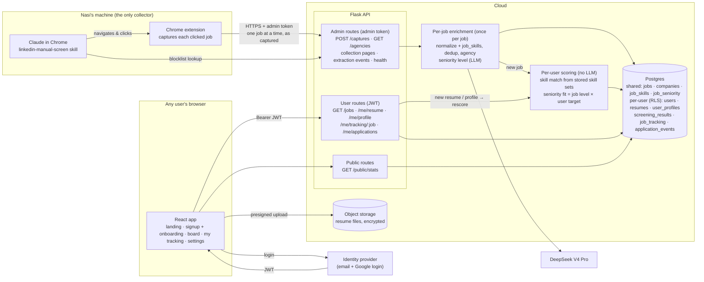
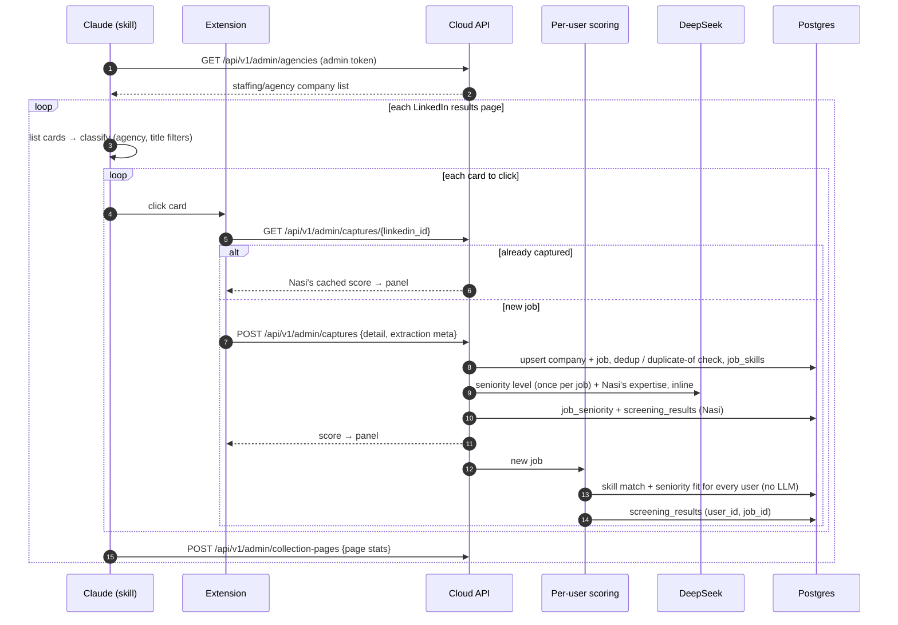

# Productization build plan: shared job board with per-user resumes, scores and tracking

Status: plan, revised 2026-09-15 (second revision: user side restored from `multi_tenant_plan.md`; seniority classified once per job; Nasi pays for LLM calls).

**Product shape.** Nasi collects jobs; the board of jobs is shared. Each user signs up, uploads a resume, enters their seniority target, and gets **their own** Skill Match and Seniority Fit on every job. Users browse the board and track their own applications. Users never run collection.

**Local stays as it is.** The local Flask server, the SQLite database (`data/job_hunt.db`), the extension flow and today's scores keep working unchanged. The cloud is built **alongside** local, never as a replacement.

**Where this comes from.**
- **Collection** (Nasi is the only collector; the extension pushes to the cloud API) is this document's design.
- **The user side** (resume ingest, a user profile with a seniority target taken from user input, per-user scores, application history) follows [`multi_tenant_plan.md`](multi_tenant_plan.md), with one change: seniority is classified **once per job** and each user's fit is computed in code, instead of a per-user prompt (§3.3). Postgres + Alembic, JWT auth and the AWS layout also still apply from there.
- **Resume parsing and skill extraction** are specified in [`resume_jd_skill_pipeline.md`](resume_jd_skill_pipeline.md). That document wins on details (package `resume/`, not `profile/`; deterministic extraction; PII redaction).

**Who pays:** Nasi pays for all LLM calls for now. Users trigger none.

**Out of scope:** users running collection, the AI chat widget, payments. **Deferred:** Expertise Match for users. Nasi's hardcoded D/C/W prompt is not parameterized; it is likely to be replaced by a semantic resume-to-JD match, designed separately.

---

## 0. Where we are today

| Piece | State |
|---|---|
| Collection | Nasi runs the `linkedin-manual-screen` skill on a local machine (Claude in Chrome drives LinkedIn). The extension captures each clicked job and `POST`s it to `http://127.0.0.1:5050/api/extension/jobs` with no auth. The API saves it and scores it immediately |
| Scoring | Skill (deterministic, reads `resume.content`), plus Seniority Fit and Expertise Match (2 DeepSeek V4 Pro calls). Tuned to Nasi's profile: "prioritizing entry-level" is hardcoded in `judge/seniority_fit.py:31`. Runs **once per job** |
| Resume | One `resume` row per track, no owner. `resume/` package (to-text, PII redaction) built and tested; not wired to storage or an endpoint |
| Dashboard | React app in `frontend/`, served at `/app/`; old page still at `/` |
| API | Flask `backend/app.py`, no auth, `CORS(app)` wide open |
| Database | One SQLite file on Nasi's machine, hand-rolled `_migrate_*` chain in `db/session.py` |
| Tracking state | `applied` / `applied_at` / `applied_resume_version` / `expired` / `not_interested` / `not_interested_note` / `note` are columns on the shared `jobs` row, so there is only room for one person's status |

---

## 1. Target system design



**Rules the design is built around**

1. **A job posting is the same for everyone; a score is per person.** Jobs, companies and `job_skills` are shared and written only by the admin token. Skill extraction, dedup and agency checks run **once per job**.
2. **Everything about a user is private.** Resume, profile, scores, tracking and application history are keyed by `user_id`. A user can only read or write their own rows.
3. **The user id comes only from the verified token.** No endpoint accepts a user id in a path, query string or body.
4. **User input wins over inference.** The seniority target is what the user chose, never a value inferred from the resume that overrides it.
5. **No per-user LLM calls.** Every LLM call is per job (seniority level for everyone, Expertise for Nasi) and Nasi pays for it. A user's scores are computed in code from stored data, so uploading a resume or changing a seniority target rescores the whole board in seconds.

---

## 2. Collection flow (Nasi → cloud)



What changes from today:

- **The extension sends every capture twice:** to the local server exactly as today, and to the cloud API with the admin token. The local panel and local scores never wait on or depend on the cloud.
- **Offline queue:** if the cloud is unreachable, the extension keeps captures in `chrome.storage.local` and retries with backoff. A lost network connection must never lose a capture.
- **The skill keeps reading local SQLite** for step 0 (the agency list) and `classify.py`. Local stays the source of truth for collection.
- **Nasi's screening stays inline for now**, because the panel shows the score on capture and the skill's pacing depends on it. If the host's request timeout becomes a problem (API Gateway has a 29s limit; two DeepSeek calls usually take 5–15s), switch to "capture returns right away, panel polls for the score". **Other users' scores need no LLM call**; they are computed right after the job's level is stored.
- **The skill's title filter (skip Staff/Principal) stays.** It decides what gets collected. A user whose seniority target is senior will see fewer matching jobs; see open decision 2.

---

## 3. User profile, resume and scoring

### 3.1 Resume ingest: package `resume/`

Specified in [`resume_jd_skill_pipeline.md`](resume_jd_skill_pipeline.md). Summary:

```python
# resume/resume_text.py
resume_to_text(filename, data: bytes) -> ResumeDocument    # pdfplumber / python-docx / txt; UnsupportedResume on scans
# resume/pii.py
redact_pii(text, identity: KnownIdentity) -> str           # known identity + patterns + header cut
# resume/pipeline.py
process_resume(filename, data, identity) -> ProcessedResume  # text (encrypted at rest), redacted_text, skills
```

- Skills are extracted with the same deterministic `SKILL_TAXONOMY` extractor as JDs, **once per resume version**, and stored.
- After upload the user sees a **"confirm your skills"** step where they can add or remove extracted skills. The confirmed set is what matching uses.
- Only `redacted_text` may go into logs, LLM calls or embeddings.

### 3.2 User profile: new module `user_profile/`

```python
# user_profile/model.py
class ProfileInput(BaseModel):        # what the user typed; always wins
    seniority_target: SeniorityLevel  # intern | entry | mid_senior | senior | staff_principal (§3.3)
    target_roles: list[str]
    note: str | None                  # free text; not used in scoring yet

class UserProfile(BaseModel):
    version: int
    seniority_target: str             # from ProfileInput, never overridden
    years_experience: int | None      # inferred from the resume, shown to the user as a hint only
    skills: list[str]                 # confirmed resume skills

# user_profile/build.py
build_profile(processed: ProcessedResume, user_input: ProfileInput) -> UserProfile
```

- **`UserProfile` is versioned, not mutated.** Editing the profile or uploading a new resume writes `version = n+1`. Old screening results stay attributable to the profile that produced them.
- **Nasi's profile** is created by migration from today's resume rows with target `entry`, so Nasi's scores don't change (parity check, §3.4).
- `career_goals` and the admin `resume` table fold into Nasi's `user_profiles` / `resumes` rows.
- **Expertise is not in the profile yet.** It will be added when the semantic match is designed.

### 3.3 Seniority: job level once per job, fit per user in code

Decided 2026-09-15. The LLM classifies each posting's **level** once, shared by every user. Each user's Seniority Fit is computed in code from that level and their target. There are no per-user LLM calls, and changing a target rescores the board instantly.

```python
# judge/seniority_level.py      — replaces the scoring in judge/seniority_fit.py
SeniorityLevel = Literal["intern", "entry", "mid_senior", "senior", "staff_principal"]

class JobSeniority(BaseModel):
    evidence: str
    years_required: int | None
    inferred: bool
    confidence: Literal["high", "medium", "low"]
    note: str | None
    level: SeniorityLevel | None                                     # None = nothing inferable (today's rule 7)
    non_fit_reason: Literal["agency", "contract"] | None  # scored with the user's "not a fit" row

SENIORITY_LEVEL_PROMPT     # today's prompt without the "my profile" paragraph; outputs level + non_fit_reason, not a 0–5 score
classify_job_seniority(posting_text: str) -> JobSeniority

# analysis/seniority_fit.py     — deterministic
seniority_fit(job: JobSeniority, target: SeniorityLevel) -> int   # 0–5

# analysis/skill_match.py
skill_match_from_skills(job_skills: set[str], resume_skills: set[str]) -> dict

# analysis/user_scoring.py      — no LLM
score_user(user_id: int) -> RunSummary          # whole board for one user: onboarding, resume or target change
score_job_for_all_users(job_id: int) -> None    # after a capture
```

**Levels** (decided 2026-09-16): `intern` (internship / co-op) · `entry` [0, 2) · `mid_senior` [2, 5) · `senior` [5, 9) · `staff_principal` 9+.

**Fit: each user's own score table** (decided 2026-09-16)

The user picks their level; the next screen proposes a 0-5 score for every job level from it and asks them to agree or adjust. Seniority Fit is then a lookup in the confirmed table (`user_profiles.seniority_scores`, locked per profile version).

| Row | Proposed score |
|---|---|
| each level | `max(0, 5 − |index(level) − index(picked level)|)` |
| `not_a_fit` (agency / contract, one shared row) | 0 |
| `unknown` (level unclear) | 3 (today's rule 7) |

Until the user confirms, the proposal for their picked level is used. Changing the level later clears the table until it is confirmed again.

With target `entry` this gives exactly today's scores: entry 5, mid 4, senior 3, senior_plus 2, staff 1, principal 0. Today's score 0 also covers agency, contract and internship postings. Splitting those into `non_fit_reason` means a user targeting principal sees principal roles as a fit, while agency and contract postings stay 0 for everyone.

The agency rule, contract rule, evidence format and `judge/structured_retry.py` carry over into the level prompt unchanged.

**When scores change**

| Trigger | Skill Match | Seniority Fit | LLM calls |
|---|---|---|---|
| User finishes onboarding | All jobs | All jobs | None |
| Resume re-upload / skills edited | All of that user's jobs | — | None |
| Level picked or changed (`set_seniority_target`) | — | All jobs, from the proposal (new profile version) | None |
| Score table confirmed (`set_seniority_scores`) | — | All jobs, from the table (new profile version) | None |
| Nasi captures a new job | Every user | Every user | 1 level classification, shared |
| Level prompt version bumped | — | Every user, after the gate passes and jobs are re-classified | 1 per re-classified job |

### 3.4 Evaluation

The seniority eval now measures **level classification**, which is the same for every user, so examples don't need a profile. The fit function is plain code and is covered by unit tests.

```python
# tests_and_eval/eval/datasets.py
build_level_set() -> None
    # posting -> hand-labelled level + non_fit_reason. Convert the existing
    # test_seniority_n_expertise labels: 5..1 map straight to entry..staff; label-0 examples
    # are relabelled by hand as principal / agency / contract / internship.

# tests_and_eval/eval/scorers.py
level_mae_scorer (distance in levels) · within_one_scorer · non_fit_recall_scorer · schema_validity_scorer · evidence_grounding_scorer

# tests_and_eval/eval/regression_gate.py
run_gate(prompt_version, thresholds) -> GateResult
    # blocks a prompt/model change that raises level MAE above baseline + 0.1,
    # or drops agency/contract/internship recall below 0.95

# tests_and_eval/eval/online.py
outcome_correlation(since: date) -> OutcomeReport   # scores vs application_events outcomes, per user and pooled
score_drift(window_days: int) -> DriftReport        # alarm on a >0.5 mean shift with no prompt change

# tests_and_eval/test_seniority_fit.py
# every level × target, plus non_fit_reason and level=None
```

**Parity check before any user sees a score:** on the existing dataset, `seniority_fit(classify_job_seniority(posting), "entry")` must match today's seniority MAE (0.317) within noise. If it doesn't, removing the profile paragraph changed how postings are judged.

---

## 4. Data model

```mermaid
erDiagram
    users ||--o{ resumes : uploads
    users ||--o{ user_profiles : "versioned"
    users ||--o{ screening_results : "own scores"
    users ||--o{ job_tracking : "tracks"
    users ||--o{ application_events : "history"
    users ||--o{ api_tokens : "admin only"
    jobs ||--o{ screening_results : "scored per user"
    jobs ||--o{ job_tracking : "tracked by many users"
    jobs ||--o{ application_events : ""
    companies ||--o{ jobs : posts
    jobs ||--o{ job_skills : "extracted once"
    jobs ||--o| job_seniority : "classified once"

    users {
        int id PK
        string idp_subject UK "JWT sub, the only identity input"
        string email
        string display_name
        string role "user | admin"
        date last_active_at "drives who gets screened on new captures"
        int taxonomy_version_seen
        timestamp created_at
        timestamp deleted_at
    }
    resumes {
        int id PK
        int user_id FK
        int version
        string storage_key "encrypted original file"
        text text_encrypted "normalized, never logged"
        text redacted_text
        json skills_extracted
        json skills_confirmed "after the user's edits"
        int taxonomy_version
        timestamp uploaded_at
    }
    user_profiles {
        int id PK
        int user_id FK
        int version
        int resume_id FK
        string seniority_target "user input: entry … principal"
        json target_roles
        text note
        int years_experience "inferred hint"
        timestamp created_at
    }
    screening_results {
        int id PK
        int user_id FK
        int job_id FK
        int profile_version
        int taxonomy_version
        int skill_score
        json skill_matched
        json skill_missing
        int seniority_score "fit: job level × target, computed"
        int expertise_score "Nasi only until redesigned"
        int total_score
    }
    job_tracking {
        int id PK
        int user_id FK
        int job_id FK
        bool applied
        timestamp applied_at
        string applied_resume_version
        bool not_interested
        text not_interested_note
        text note
        timestamp updated_at
    }
    application_events {
        int id PK
        int user_id FK
        int job_id FK
        string stage "applied | rejected | recruiter_screen | interview | offer | withdrawn"
        timestamp occurred_at
        text note
    }
    api_tokens {
        int id PK
        int user_id FK "must be an admin"
        string token_hash "sha256; plaintext shown once"
        string label "e.g. extension-macbook"
        timestamp last_used_at
        timestamp revoked_at
    }
    jobs {
        int id PK
        string job_id UK "LinkedIn id"
        string track
        bool expired "shared: listing is dead for everyone"
        text raw_text
        timestamp first_seen_at
    }
    job_seniority {
        int id PK
        int job_id FK "unique"
        string level "entry … principal, or null"
        string non_fit_reason "agency | contract | internship, or null"
        int years_required
        bool inferred
        string confidence
        text evidence
        text note
        string prompt_version
    }
```



- **As built (phase 2, 2026-09-15).** Local code still reads and writes the shared tables in today's shape, so the cloud keeps that shape exactly and puts everything per user in new tables (`db/cloud_models.py`, own metadata, never loaded locally). Two changes from the diagram above:
  - `screening_results` is **not** given a `user_id`. It stays the owner's per-job LLM output; each user's computed scores go to **`user_job_scores`** `(user_id, job_id, profile_version, taxonomy_version, skill_*, seniority_fit, total_score)`.
  - The tracking columns stay on `jobs` for schema parity with local, but `seed_owner` clears them in the cloud after moving them to `job_tracking`, so a job's status lives only there. The API never returns them.
  - `users.idp_subject` is nullable: the owner row exists before the identity provider, and the first login claims it.
- **Unique:** `job_seniority (job_id)`, `user_job_scores (user_id, job_id)`, `job_tracking (user_id, job_id)`, `user_profiles (user_id, version)`, `resumes (user_id, version)`.
- **`job_tracking` is current status; `application_events` is history.** Changing status writes the new state to `job_tracking` and appends an event, so status history is kept instead of overwritten. That history is what makes `outcome_correlation` possible.
- **`expired` stays on `jobs`, shared.** A dead listing is dead for everyone. Only admins can set it in v1; see open decision 3.
- **Migrating Nasi's data** (`python -m db.seed_owner`, once, after `copy_to_cloud`): Nasi becomes user #1 (admin) with profile version 1 (target `entry`). Existing seniority scores 1–5 backfill `job_seniority.level` directly (5 → entry … 1 → staff; 3 at low confidence → level NULL, "nothing inferable"). Score-0 jobs get no row until they are re-classified in phase 4, because 0 mixes principal with agency / contract / internship. Every job with `applied`, `not_interested`, a note or `applied_resume_version` set becomes a `job_tracking` row, plus an `applied` event where `applied_at` is known; those fields are then cleared on the shared `jobs` row.
- **`company_applied_count`** ("applied 3× at this company") becomes per user, counted over the caller's own `job_tracking` rows.
- **Admin-only tables:** `collection_pages`, `extraction_events`, `scrape_runs`, `chat_messages`.

---

## 5. Authentication, separate user access and PII

### 5.1 Authentication

| Who | How | Why |
|---|---|---|
| **Users (browser)** | Managed identity provider, email/password + Google, issuing a JWT (~1h access token, refreshed by the provider SDK). **Cognito** if hosting on AWS; **Clerk** or **Supabase Auth** if not (faster to set up, same JWT verification on our side) | No password storage, reset or verification flows in our code |
| **Nasi (browser)** | Same login; `users.role = 'admin'` set by migration, never self-service | Admin is a role, not a separate login |
| **Extension + skill** | Long-lived **admin API token** created from an admin settings page, stored hashed, revocable, with a label and last-used time | A headless extension can't do an OAuth login mid-run |
| **Local development** | `FakeVerifier` behind the same `verify_jwt()` interface, enabled only when `AUTH_MODE=dev` and the server is bound to localhost | Build and test everything before choosing a provider |

```python
# auth/verify.py
verify_jwt(token: str) -> Claims            # JWKS cached; iss, aud, exp checked
class FakeVerifier: ...                      # dev only: "Bearer dev:<email>"

# auth/users.py
get_or_create_user(claims: Claims) -> User  # keyed on claims.sub, never on email

# auth/decorators.py
require_user(fn)                             # 401 if no/invalid JWT; sets g.user
require_admin(fn)                            # admin JWT or valid admin API token; else 403
```

The JWT lives in memory via the provider SDK, not in `localStorage`. CORS narrows from `CORS(app)` to the app's own origin, plus the extension's `chrome-extension://<id>` origin on admin routes.

### 5.2 Separate user access: layers of protection

Per-user tables: `resumes`, `user_profiles`, `screening_results`, `job_tracking`, `application_events`.

| Layer | Mechanism | Catches |
|---|---|---|
| **1. API shape** | Per-user routes are `/me/...`. Per-job user data is addressed by `job_id` only and always resolved as `(g.user.id, job_id)` | Changing an id in a URL or body to reach someone else's data |
| **2. One repository per table** | All access to per-user tables goes through `user_data_repo.py`, which always filters on the current user. A test fails if a per-user table is queried anywhere else (per-user scoring uses the same repo with an explicit user) | A new endpoint that forgets the filter |
| **3. Postgres Row-Level Security** | RLS on every per-user table, policy `user_id = current_setting('app.user_id')::int`, set with `SET LOCAL` per request transaction. The app's DB role is not the table owner (owners bypass RLS). Admin writes to shared tables use a separate role with no access to per-user tables | Anything layers 1–2 miss, including raw SQL |
| **4. Response shaping** | `/jobs` joins the caller's scores and tracking only. Admin fields (`raw_text`, extraction metadata, collection health detail) are left out of user responses | Leaking admin/operational data to users |

Rules:

- **Admin sees only their own resume, scores and tracking.** Admin powers cover shared data (captures, expiry, health), not other users' data. There is no "view as user".
- **Account deletion** is a hard delete: `users` and every per-user row, the resume files in object storage, and any LLM traces that contain the user's data.
- **Rate limiting** on authenticated routes, a stricter limit on public stats, and a size/type limit on resume upload.

### 5.3 Resumes are PII

- Resume files encrypted at rest (SSE-KMS or the provider's equivalent), uploaded with a presigned PUT straight from the browser so the file never passes through the API process.
- `text_encrypted` is never logged. Only `redacted_text` may reach LLM calls, traces or embeddings.
- No LLM call receives resume text or anything else about a user. Seniority classification sees only the posting.

### 5.4 Isolation test suite (gate before any second user)

```python
# tests_and_eval/test_isolation.py — fixtures: admin, user_a, user_b (FakeVerifier), shared jobs
test_every_user_route_requires_auth        # walks app.url_map: no token -> 401 on every non-public route
test_every_admin_route_rejects_users       # walks app.url_map: user JWT -> 403 on every /admin route
test_scores_are_per_user                   # A and B see the same job with their own scores
test_job_skills_extracted_once             # two users, one job -> one job_skills extraction, one seniority classification
test_resume_is_private                     # B cannot read A's resume or profile through any route
test_tracking_is_private                   # A marks applied + note; B's /jobs and /me/tracking show neither
test_application_events_are_private
test_b_cannot_write_a_rows                 # no request shape lets B change A's rows
test_company_applied_count_is_per_user
test_user_responses_exclude_admin_fields   # raw_text, extraction meta absent
test_rls_blocks_query_without_user_setting # raw SQL as app role without SET LOCAL -> 0 rows, every per-user table
test_no_route_accepts_user_id              # static check over route params + request schemas
test_account_deletion_purges_everything    # rows, resume files, traces
test_revoked_admin_token_rejected
```

Walking the route map means a newly added route is covered automatically.

---

## 6. API surface

| Route | Auth | Purpose |
|---|---|---|
| `GET /api/public/stats` | none | Landing page numbers: collected today, total scored, remote count, last collection time. Aggregates only |
| `GET /api/v1/me` | user | Account, role and onboarding state; creates the user on first login |
| `DELETE /api/v1/me` | user | Delete account and all the user's data |
| `POST /api/v1/me/resume` | user | Returns a presigned upload URL; on completion, `process_resume` → extracted skills for confirmation |
| `GET /api/v1/me/resume` | user | Current resume version, extracted and confirmed skills |
| `PUT /api/v1/me/resume/skills` | user | Confirm / edit the skill set → new resume version, Skill Match recomputed |
| `GET /api/v1/me/profile` | user | Current profile: seniority target, target roles, note |
| `PUT /api/v1/me/profile` | user | Update profile → new version; Seniority Fit recomputed for every job in code |
| `GET /api/v1/jobs` | user | Shared jobs joined with the caller's own scores and tracking; `company_applied_count` is per caller |
| `PUT /api/v1/me/tracking/{job_id}` | user | Upsert own applied / not_interested / notes; appends an application event on status change |
| `POST /api/v1/me/applications/{job_id}/events` | user | Record a later stage (recruiter screen, interview, offer, rejected) |
| `GET /api/v1/me/applications` | user | The caller's applications with stage history |
| `GET /api/v1/health/summary` | user | "Board last updated N hours ago" (state + age only) |
| `POST /api/v1/admin/captures` | admin | Extension capture → upsert + enrich (job_skills, seniority level) + Nasi's Expertise inline + rescore users (replaces `/api/extension/jobs`) |
| `GET /api/v1/admin/captures/{linkedin_id}` | admin | Cached-score lookup (replaces `/api/extension/jobs/<id>`) |
| `GET /api/v1/admin/agencies` | admin | Blocklist for the skill's step 0 / `classify.py` |
| `POST /api/v1/admin/collection-pages` | admin | Per-page collection stats |
| `PATCH /api/v1/admin/jobs/{id}` | admin | Shared fields: `expired` |
| `GET /api/v1/admin/health` | admin | Full health (last run, failing fields, incomplete run, daily LLM spend) |
| `POST/DELETE /api/v1/admin/tokens` | admin | Create/revoke extension tokens |

The old unauthenticated routes (`/api/jobs`, `/api/extension/*`, the old `PATCH /api/jobs/<id>`) are removed once the extension and React app have moved over.

---

## 7. Frontend

| Route | Who | Contents |
|---|---|---|
| `/` | public | Landing page from the Figma design: hero, the animated scoring demo using real top jobs, a ticker fed by `/api/public/stats`. No hardcoded numbers |
| `/login`, `/signup` | public | Provider's hosted or embedded UI |
| `/app/onboarding` | user | Required after first login: **1.** upload resume → **2.** confirm skills → **3.** pick seniority level (Intern · Entry 0–2 yrs · Mid–senior 2–5 · Senior 5–9 · Staff / principal 9+), target roles, optional note → **4.** "We score seniority 0–5": the proposed score for each job level, not a fit and level unclear, each adjustable; agree or adjust, then confirm (locked; editable later in Settings) → **5.** the board opens with the user's Skill Match and Seniority Fit on every job, no waiting |
| `/app` | user | Today's board with the caller's own scores. Status actions write to `/me/tracking`; "Applied" view shows the caller's applications and stages |
| `/app/settings` | user | Display name; resume (re-upload, edit skills); seniority target and roles; "Update my old scores" (§9); delete account |
| `/app/admin` | admin | Full health, extension tokens, collection stats, LLM spend |

- The API client attaches the JWT, and a 401 redirects to `/login`. A user who hasn't finished onboarding is redirected to `/app/onboarding`.
- **"Mark expired" moves to admin only.** Users get "Not interested" with a reason instead.
- **Expertise column** is shown to Nasi only until the semantic match replaces it.

---

## 8. Build phases

| # | Phase | Contents | Done when |
|---|---|---|---|
| **1** | **Cloud database alongside local** | `DATABASE_URL` selects the database: unset means today's SQLite file with its `_migrate_*` chain, untouched. Alembic migrations target Postgres only; docker-compose Postgres to test the cloud schema locally; a one-way copy script SQLite → Postgres | Local server, extension and skill unchanged on SQLite (full test suite + a live capture); the same code passes against docker Postgres loaded with the copied data |
| **2** | **Users + per-user schema (cloud only)** | `db/cloud_models.py` on its own metadata: `users`, `resumes`, `user_profiles`, `job_seniority`, `job_tracking`, `application_events`, `user_job_scores`, `api_tokens`; shared tables keep the local shape; `python -m db.seed_owner` makes Nasi user #1 (profile v1 target `entry`, statuses → `job_tracking`, `applied` events, seniority 1–5 → `job_seniority`) | Row counts match local SQLite; Nasi's applied/not-interested/notes all present as user #1 |
| **3** | **Resume ingest** | Finish `resume_jd_skill_pipeline.md` §6 step 12 (`process_resume`); encrypted storage; confirm-skills flow in the API; `skill_match_from_skills` over stored sets | Test resumes → expected skills, no PII in `redacted_text`; Nasi's re-uploaded resume reproduces today's skill scores |
| **4** | **Profile + per-job seniority level** | `user_profile/`; `SENIORITY_LEVEL_PROMPT` + `JobSeniority`; `seniority_fit(level, target)`; `user_scoring`; backfill `job_seniority` (score-0 jobs re-classified); level eval set + regression gate | Parity: fit with target `entry` matches Nasi's seniority MAE 0.317 within noise; fit unit-tested for every level × target; gate blocks a deliberately bad prompt |
| **5** | **Auth + separate access** | `auth/` module, `FakeVerifier`, `require_user` / `require_admin`, `user_data_repo`, RLS policies + DB roles, `/api/v1` routes, CORS narrowed | §5.4 suite green |
| **6** | **Extension → local and cloud** | Each capture goes to the local server exactly as today **and** to the cloud API (admin token; offline queue for the cloud copy); collection pages also posted to the cloud; cloud capture rescores every user | Local captures and scores unchanged; the cloud receives every capture of a full skill run, and stopping the cloud API mid-run loses none |
| **7** | **Frontend auth, onboarding + tracking** | Login/signup, onboarding flow, settings, JWT client, per-user scores and "Applied" view with stages, admin page | Two browser profiles with different resumes and seniority targets see different scores on the same jobs and only their own tracking |
| **8** | **Landing page** | Figma hero + demo + ticker on `/api/public/stats` | Works logged out; every number comes from the API |
| **9** | **Hosting** | Identity provider (real `verify_jwt`), managed Postgres, object storage for resumes, API host, static hosting for `frontend/dist`, secrets manager for DeepSeek + DB credentials, backups, spend alarms | Nasi's daily skill runs push to the hosted API; a second real user onboards, gets scores and tracks jobs |
| **10** | **Taxonomy refresh on a schedule** | The `taxonomy-refresh` skill (§9) scheduled as a biweekly cloud routine against hosted Postgres; read-only DB role, secrets, PR permission, failure alert | A scheduled run opens a PR with candidates, corpus checks, tests and a churn report; merging it and re-extracting updates `job_skills` |

Phases 1–5 are all local. Phase 4's prompt-parity eval and phase 5's isolation suite are both gates: no second user before they pass.

**Status (2026-09-15): phase 1 built** on branch `feat/cloud-prep`. `JHI_DATABASE_URL` selects Postgres (unset = local SQLite, unchanged); Alembic baseline `ca4ae71d4189` matches the models (`alembic check` in `test_cloud_db.py`); `python -m db.copy_to_cloud` seeded a test Postgres from the live local file in 11 s with every table's row count matching, except 18 `job_skills` rows that point at jobs no longer in SQLite (skipped and reported). Remaining for "done when": merge, then confirm a live capture still works locally.

**Status (2026-09-15): phase 2 built.** `db/cloud_models.py` + migration `ff9123bfee52`; `python -m db.seed_owner` on the live copy: 1,078 `job_tracking` rows, 393 `applied` events, 11,189 `job_seniority` levels, 2,327 score-0 jobs waiting for phase 4, all equal to local SQLite.

**Status (2026-09-15): phase 3 built.** Decision: **one active resume per user** (the one the latest profile version points at); other uploads stay as earlier versions. `resume/store.py` (Fernet-encrypted files and text, `LocalFileStore` until S3), `resume/ingest.py` (`add_resume`, `confirm_skills`: only taxonomy skill names, first confirmation in place, edits write a new version, activation writes a new profile version and rescores), `analysis/user_scoring.py` (`score_user` upserts `user_job_scores` from stored skill sets, duplicates not scored). `python -m db.import_owner_resumes` on the live copy: pm resume v1, ml_ai resume v2 (active), 13,665 jobs scored in 14 s. On 11,045 ml_ai jobs with a local skill score, 11,006 match; of the 39 that don't, 35 are stale local scores (re-scoring the JD text with today's code gives the cloud value) and 4 come from stored `job_skills` that predate the current taxonomy (fixed by the pending re-extraction). PM-track jobs are scored against the active ml_ai resume, as decided.

**Cost at this shape** (Nasi pays for all of it for now)

- **LLM, per job only:** seniority level (shared) + Nasi's Expertise ≈ $0.0037 per job off-peak, ~400 jobs/day ≈ $1.50/day. The same as today, for any number of users.
- **Per user:** $0 in LLM. Skill Match and Seniority Fit are computed in code.
- **One-off:** re-classifying today's score-0 jobs in the phase 4 backfill.
- **Hosting:** a small Postgres (~$13–15/mo), a small API host, object storage (a few dollars).
- **Guardrail:** a daily LLM spend alarm on Nasi's DeepSeek account.

---

## 9. Skill taxonomy maintenance (skill built now, scheduled after hosting)

Production skill extraction stays **deterministic**: regex over `SKILL_TAXONOMY` in `analysis/skills_extractor.py`, with the same vocabulary for job descriptions and resumes. That keeps it free, instant and reproducible, and keeps the skill match meaningful. An LLM is used **only offline**, to find what the vocabulary misses and propose changes that a human approves.

### Why it needs maintaining (measured 2026-09-15)

| Check | Result |
|---|---|
| Coverage: 100 random `ml_ai` JDs, DeepSeek lists candidate skills with evidence | Extractor tags cover **53%** of LLM-listed skills (an earlier 30-JD run: ml_ai 55%, pm **22%**) |
| Precision: extractor tags the LLM also listed | ~84% |
| Biggest misses: not in the vocabulary | Distributed systems, data pipelines, data modeling, testing, React, Neo4j, AI coding tools (Cursor, Claude Code), HIPAA / SOC 2, distributed training, multimodal. Most PM-track skills |
| Pattern gaps: skill exists, wording not matched | `fine tuning`, `tool-calling`, `vector search`, `ML Ops`, bare `time series`, `AI evaluation` |
| False tags | "R&D" → R on 3.6% of JDs; "Predisposition" → Redis; Recommendation Systems on project names; degrees (PhD, Master's) counted as skills |

### Prerequisites (local, can be done any time before this phase)

1. **Preserve line breaks at capture.** *Done 2026-09-15 (branch `feat/cloud-prep`; takes effect once merged and the extension is reloaded).* `extension/content/extract.js` read text with `range.toString()`, so stored `raw_text` had **no newlines** (0% of a 3,000-JD sample) and words glued together at block boundaries ("development**Experience**", "PYTHONAWSGCP"), on 70% of captures since Sep 1. Each block is now its own line. `analysis/duplicate_detector.py` drops line breaks before comparing, so a new capture still matches an old glued repost: on the stored corpus that changes 0 of 25,152 same-company duplicate decisions. Existing rows are not rewritten.
2. **Fix the known false matches**, with tests in `tests_and_eval/test_skill_extraction.py`.

Taxonomy entries stay simple: **skill name → patterns**, plus the existing category and group lists. No extra per-entry fields.

### The `taxonomy-refresh` skill

```
.claude/skills/taxonomy-refresh/
  SKILL.md              # procedure + rules for what counts as a skill
  sample_new_jds.py     # JDs captured since the last run → sample
  llm_extract.py        # DeepSeek skill listing with verbatim evidence (saved JSON)
  diff_vocab.py         # misses split into: not in vocabulary vs pattern gap; ranked by # of JDs
  check_candidate.py    # proposed pattern → hit count across the corpus + random sample of matches
  score_churn.py        # skill-match scores before vs after the change
  decisions.json        # accepted/rejected history so rejected candidates are not re-proposed
```

Each run:

1. Sample JDs collected since the last run and extract skills with the LLM.
2. Diff against the taxonomy; drop anything already rejected in `decisions.json`.
3. Agent judgment: merge synonyms, drop generic items (code review, debugging), draft patterns from the real wordings in the evidence, assign category / group / type, write should-match and should-not-match tests.
4. Verify: corpus hit count and sampled matches per candidate, `pytest` green, score churn measured.
5. Open a PR on branch `taxonomy/<date>` with the `skills_extractor.py` diff, the tests, and a report per candidate.
6. After a human merges: re-extract `job_skills` and recompute skill match. Both are deterministic, so no LLM is involved.

### Schedule

A **biweekly cloud routine** (`/schedule`) running the skill against the hosted Postgres. It is deferred to after hosting (phase 9) because the corpus lives in a local SQLite file that a cloud run cannot reach. The routine needs:

- a read-only database role
- the DeepSeek key from the secrets manager
- GitHub permission to push a branch and open a PR
- an alert when a run fails, so a broken schedule doesn't go unnoticed the way the 22 failed scraper runs did

**Cost:** ~5,600 new JDs per two weeks. A 500-JD sample ≈ $1.25; all of them ≈ $14 off-peak.

### Applying a taxonomy update to users

Once a taxonomy PR is merged, each user chooses whether their existing scores change. Nothing is recomputed without consent.

**Pop-up on next visit:**
> *Skill list updated: 12 skills added, 3 fixed.*
> ○ **Use from now on**: new job posts and your resume use the new list; existing scores stay as they are.
> ○ **Also update existing scores**: *about 40 of your jobs will change score, and 6 move into your top 20.*

| Choice | What happens |
|---|---|
| **From now on** (also the default when the pop-up is dismissed) | New JDs and the user's resume are tagged with the new version. Stored scores are untouched. Jobs scored on an older version show a small "scored with an older skill list" note |
| **Update existing scores** | Recompute that user's Skill Match (deterministic, no LLM, seconds). The preview numbers come from a per-user churn calculation run *before* they confirm |

What it needs:
- **`taxonomy_version`** on every stored skill score, and on the parsed resume skills.
- **`users.taxonomy_version_seen`**, so the pop-up shows once per update.
- **A per-user preview endpoint** (`score_churn.py` logic scoped to one user and resume) and a per-user recompute endpoint.
- **A Settings button**, "Update my old scores", for users who picked "from now on" and change their mind later.
- **Admin (Nasi) gets the same choice**, instead of `recompute_skill_scores.py --apply` running globally.

Only Skill Match is affected. Seniority and Expertise come from LLM calls and never change with the taxonomy.

### Guardrails

- **Never auto-merge.** Taxonomy changes move every user's skill scores.
- A candidate is only proposed with a corpus hit count, sampled matches and tests attached.
- Score churn is reported in the PR, not discovered afterwards.
- Production `job_skills` is re-extracted only from merged taxonomy changes.

---

## 10. Open decisions

**Decided 2026-09-15**
- **Seniority is per job.** The LLM classifies the level once; each user's fit is computed in code (§3.3).
- **Nasi pays for LLM calls for now.** Users trigger none, so no per-user quotas are needed. Revisit if the Expertise redesign adds per-user cost.
- **Host: AWS** (Cognito, RDS Postgres, S3, Lambda or App Runner, Secrets Manager).
- **LinkedIn terms of service: OK to go.** A terms-of-use page and a privacy policy covering resumes still ship before launch.
- **Open sign-up** at launch.
- **Local stays unchanged; the extension sends each capture to both local and cloud** (§2, phases 1 and 6).

**Open**

1. **Fit shape above and below target.** The default is symmetric: one level off either way costs 1 point. A user may mind an over-senior role more than a junior one, or the reverse. Keep symmetric until users say otherwise.
2. **Collection vs senior users.** Nasi's skill skips Staff/Principal titles, so users with a senior target see a thin board. Accept it (the board is curated), or widen collection.
3. **Can users mark a listing expired?** Shared expiry helps everyone but lets one user hide a job from all. Admin-only in v1 is the safe default.
4. **Expertise for users.** Semantic resume-to-JD match, designed separately. Until then `total_score` for users is Skill + Seniority; decide how it's scaled so it isn't compared with Nasi's three-part total.

## 11. Known issues to fix along the way

- 219 recent jobs (Sep 4–6) have the job **title stored as location**. This is an extraction bug in the extension, and users would see it.
- The old dashboard's company-size filter misses comma-less size strings (`1001-5000 employees`). Fixed in the React app; the old page is retired in phase 7.
