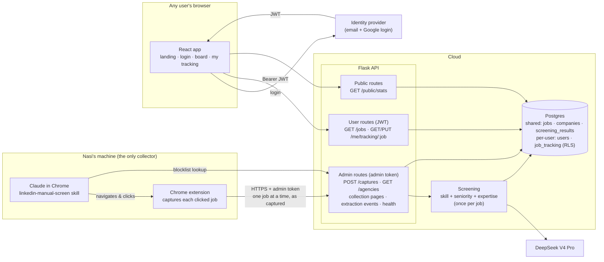
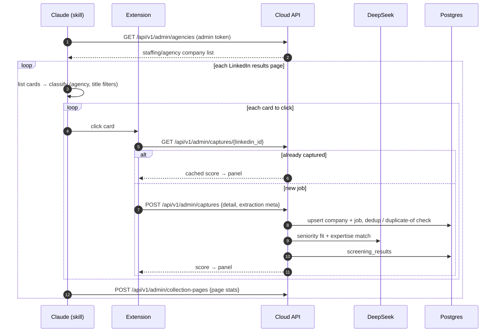
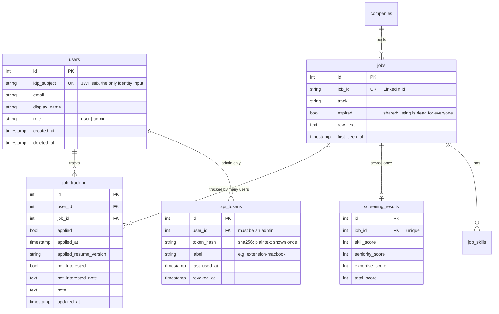

# Productization build plan: shared job board with per-user tracking

Status: plan, revised 2026-09-15.

**Product shape.** Nasi collects and scores jobs; everyone else logs in, browses the board and tracks their own applications. Users do not upload resumes, get personal scores, or run collection.

This replaces the per-user-scoring design in [`multi_tenant_plan.md`](multi_tenant_plan.md) (resume ingest, `build_profile`, parameterized judges, per-user screening). That work is **deferred, not planned**. The parts of that document that still apply: Postgres + Alembic, JWT auth, and the AWS layout.

**Out of scope:** resume upload and parsing, per-user scores, the AI chat widget, payments.

---

## 0. Where we are today

| Piece | State |
|---|---|
| Collection | Nasi runs the `linkedin-manual-screen` skill on a local machine (Claude in Chrome drives LinkedIn). The extension captures each clicked job and `POST`s it to `http://127.0.0.1:5050/api/extension/jobs` with no auth. The API saves it and scores it immediately |
| Scoring | Skill (deterministic, reads `resume.content`), plus Seniority Fit and Expertise Match (2 DeepSeek V4 Pro calls). Tuned to Nasi's profile. Runs **once per job** |
| Dashboard | React app in `frontend/`, served at `/app/`; old page still at `/` |
| API | Flask `backend/app.py`, no auth, `CORS(app)` wide open |
| Database | One SQLite file on Nasi's machine, hand-rolled `_migrate_*` chain in `db/session.py` |
| Tracking state | `applied` / `applied_at` / `applied_resume_version` / `expired` / `not_interested` / `not_interested_note` / `note` are columns on the shared `jobs` row, so there is only room for one person's status |

---

## 1. Target system design



**Rules the design is built around**

1. **Jobs, companies and scores are shared and read-only for users.** Only the admin token writes them.
2. **Tracking is personal.** Applied, not interested, notes and so on live in `job_tracking`, keyed `(user_id, job_id)`. A user can only read or write their own rows.
3. **The user id comes only from the verified token.** No endpoint accepts a user id in a path, query string or body.
4. **Per-user LLM cost is zero.** Scoring cost scales with the jobs Nasi collects, not with the number of users.

---

## 2. Collection flow (Nasi → cloud)



What changes from today:

- **The extension's `API_BASE` becomes configurable**, e.g. a local option page or a build-time constant with a local/cloud switch, and every request carries the admin token.
- **Offline queue:** if the cloud is unreachable, the extension keeps captures in `chrome.storage.local` and retries with backoff. A lost network connection must never lose a capture.
- **The skill stops reading local SQLite.** Step 0 (refreshing the agency list) and `classify.py` call `GET /api/v1/admin/agencies` instead.
- **Screening stays inline for now.** The panel shows the score on capture, and the skill's pacing depends on that. If the host's request timeout becomes a problem (API Gateway has a 29s limit; two DeepSeek calls usually take 5–15s), switch to "capture returns right away, panel polls for the score".
- **The skill's title filter (skip Staff/Principal) stays.** It reflects what the board is for, since Nasi decides what gets collected.

---

## 3. Data model



- **Unique:** `job_tracking (user_id, job_id)`. A row is created the first time a user touches a job; no row means untouched.
- **`expired` stays on `jobs`, shared.** A dead listing is dead for everyone. Only admins can set it in v1; see open decision 2.
- **Migrating Nasi's data:** Nasi becomes user #1 (admin). Every job with `applied`, `not_interested`, `note` or `applied_resume_version` set becomes a `job_tracking` row for user #1. Then those columns are dropped from `jobs`.
- **`company_applied_count`** ("applied 3× at this company") becomes per user, counted over the caller's own `job_tracking` rows.
- **Admin-only tables:** `collection_pages`, `extraction_events`, `scrape_runs`, `resume`, `career_goals`, `chat_messages`.

---

## 4. Authentication and separate user access

### 4.1 Authentication

| Who | How | Why |
|---|---|---|
| **Users (browser)** | Managed identity provider, email/password + Google, issuing a JWT (~1h access token, refreshed by the provider SDK). **Cognito** if hosting on AWS; **Clerk** or **Supabase Auth** if not (faster to set up, same JWT verification on our side) | No password storage, reset or verification flows in our code |
| **Nasi (browser)** | Same login; `users.role = 'admin'` set by migration, never self-service | Admin is a role, not a separate login |
| **Extension + skill** | Long-lived **admin API token** created from an admin settings page, stored hashed, revocable, with a label and last-used time | A headless extension can't do an OAuth login mid-run |
| **Local development** | `FakeVerifier` behind the same `verify_jwt()` interface, enabled only when `AUTH_MODE=dev` and the server is bound to localhost | Build and test everything before choosing a provider |

```python
# auth/verify.py
verify_jwt(token: str) -> Claims            # JWKS cached; iss, aud, exp checked
class FakeVerifier: ...                      # dev only: "Bearer dev:<email>"

# auth/users.py
get_or_create_user(claims: Claims) -> User  # keyed on claims.sub, never on email

# auth/decorators.py
require_user(fn)                             # 401 if no/invalid JWT; sets g.user
require_admin(fn)                            # admin JWT or valid admin API token; else 403
```

The JWT lives in memory via the provider SDK, not in `localStorage`. CORS narrows from `CORS(app)` to the app's own origin, plus the extension's `chrome-extension://<id>` origin on admin routes.

### 4.2 Separate user access: layers of protection

| Layer | Mechanism | Catches |
|---|---|---|
| **1. API shape** | Per-user routes are `/me/...`. Tracking is addressed by `job_id` only and always resolved as `(g.user.id, job_id)` | Changing an id in a URL or body to reach someone else's data |
| **2. One repository** | All `job_tracking` access goes through `tracking_repo.py`, which always filters on the current user. A test fails if `job_tracking` is queried anywhere else | A new endpoint that forgets the filter |
| **3. Postgres Row-Level Security** | RLS enabled on `job_tracking`, policy `user_id = current_setting('app.user_id')::int`, set with `SET LOCAL` per request transaction. The app's DB role is not the table owner (owners bypass RLS). Admin writes to shared tables use a separate role with no access to `job_tracking` | Anything layers 1–2 miss, including raw SQL |
| **4. Response shaping** | `/jobs` joins the caller's tracking only. The admin fields (`raw_text`, extraction metadata, collection health detail) are left out of user responses | Leaking admin/operational data to users |

Rules:

- **Admin sees only their own tracking.** Admin powers cover shared data (captures, expiry, health), not other users' notes. There is no "view as user".
- **Account deletion** removes the user's `users` and `job_tracking` rows immediately, not a soft delete.
- **Rate limiting** on authenticated routes, and a stricter limit on public stats.

### 4.3 Isolation test suite (gate before any second user)

```python
# tests_and_eval/test_isolation.py — fixtures: admin, user_a, user_b (FakeVerifier), shared jobs
test_every_user_route_requires_auth        # walks app.url_map: no token -> 401 on every non-public route
test_every_admin_route_rejects_users       # walks app.url_map: user JWT -> 403 on every /admin route
test_tracking_is_private                   # A marks applied + note; B's /jobs and /me/tracking show neither
test_b_cannot_write_a_tracking             # no request shape lets B change A's row
test_company_applied_count_is_per_user
test_user_responses_exclude_admin_fields   # raw_text, extraction meta absent
test_rls_blocks_query_without_user_setting # raw SQL as app role without SET LOCAL -> 0 rows
test_no_route_accepts_user_id              # static check over route params + request schemas
test_revoked_admin_token_rejected
```

Walking the route map means a newly added route is covered automatically.

---

## 5. API surface

| Route | Auth | Purpose |
|---|---|---|
| `GET /api/public/stats` | none | Landing page numbers: collected today, total scored, remote count, last collection time. Aggregates only |
| `GET /api/v1/me` | user | Profile and role; creates the user on first login |
| `DELETE /api/v1/me` | user | Delete account and tracking |
| `GET /api/v1/jobs` | user | Shared jobs + scores, joined with the caller's own tracking; `company_applied_count` is per caller |
| `PUT /api/v1/me/tracking/{job_id}` | user | Upsert own applied / not_interested / notes |
| `GET /api/v1/health/summary` | user | "Board last updated N hours ago" (state + age only) |
| `POST /api/v1/admin/captures` | admin | Extension capture → upsert + screen (replaces `/api/extension/jobs`) |
| `GET /api/v1/admin/captures/{linkedin_id}` | admin | Cached-score lookup (replaces `/api/extension/jobs/<id>`) |
| `GET /api/v1/admin/agencies` | admin | Blocklist for the skill's step 0 / `classify.py` |
| `POST /api/v1/admin/collection-pages` | admin | Per-page collection stats |
| `PATCH /api/v1/admin/jobs/{id}` | admin | Shared fields: `expired` |
| `GET /api/v1/admin/health` | admin | Full health (last run, failing fields, incomplete run), as `/api/health` today |
| `POST/DELETE /api/v1/admin/tokens` | admin | Create/revoke extension tokens |

The old unauthenticated routes (`/api/jobs`, `/api/extension/*`, the old `PATCH /api/jobs/<id>`) are removed once the extension and React app have moved over.

---

## 6. Frontend

| Route | Who | Contents |
|---|---|---|
| `/` | public | Landing page from the Figma design: hero, the animated scoring demo using real top jobs, a ticker fed by `/api/public/stats`. No hardcoded numbers |
| `/login`, `/signup` | public | Provider's hosted or embedded UI. Sign-up is just an account, with no onboarding steps |
| `/app` | user | Today's board. Status actions write to `/me/tracking`; "Applied" view shows the caller's own applications |
| `/app/settings` | user | Display name, delete account |
| `/app/admin` | admin | Full health, extension tokens, collection stats |

- The API client attaches the JWT, and a 401 redirects to `/login`.
- **"Mark expired" moves to admin only.** Users get "Not interested" with a reason instead.

---

## 7. Build phases

| # | Phase | Contents | Done when |
|---|---|---|---|
| **1** | **Postgres + Alembic** | Alembic baseline replaces `_migrate_*`; `DATABASE_URL`; docker-compose Postgres; copy existing SQLite data | Today's dashboard, extension and skill work unchanged against local Postgres |
| **2** | **Users + tracking schema** | `users`, `job_tracking`, `api_tokens`; migrate Nasi's statuses into `job_tracking` for user #1; drop tracking columns from `jobs`; `company_applied_count` per user | Row counts match before/after: Nasi's applied/not-interested/notes all present as user #1 |
| **3** | **Auth + separate access** | `auth/` module, `FakeVerifier`, `require_user` / `require_admin`, `tracking_repo`, RLS policy + DB roles, `/api/v1` routes, CORS narrowed | §4.3 suite green |
| **4** | **Extension + skill → cloud API** | Configurable `API_BASE`, admin token header, offline capture queue, skill step 0 + `classify.py` use `/admin/agencies`, collection pages posted | A full skill run against the local `/api/v1` stack matches a run against today's API; killing the server mid-run loses no captures |
| **5** | **Frontend auth + tracking** | Login/signup routes, JWT client, tracking writes to `/me/tracking`, admin page, per-user "Applied" view | Two browser profiles log in as different users; each sees only their own applied/notes on the same jobs |
| **6** | **Landing page** | Figma hero + demo + ticker on `/api/public/stats` | Works logged out; every number comes from the API |
| **7** | **Hosting** | Identity provider (real `verify_jwt`), managed Postgres, API host, static hosting for `frontend/dist`, secrets manager for DeepSeek + DB credentials, backups | Nasi's daily skill runs push to the hosted API; a second real user logs in and tracks jobs |
| **8** | **Taxonomy refresh on a schedule** | The `taxonomy-refresh` skill (§8, already built and run by hand locally) scheduled as a biweekly cloud routine against hosted Postgres; read-only DB role, secrets, PR permission, failure alert | A scheduled run opens a PR with candidates, corpus checks, tests and a churn report; merging it and re-extracting updates `job_skills` |

Phases 1–3 are all local. Phase 3's isolation suite is the gate: no second user before it passes.

**Cost at this shape:** LLM ≈ $0.0037 × jobs Nasi collects per day off-peak (~400/day ≈ $1.50/day), the same for any number of users. Hosting is a small Postgres (~$13–15/mo) plus a small API host.

---

## 8. Skill taxonomy maintenance (skill built now, scheduled after hosting)

Production skill extraction stays **deterministic**: regex over `SKILL_TAXONOMY` in `analysis/skills_extractor.py`, with the same vocabulary for job descriptions and resumes. That keeps it free, instant and reproducible, and keeps the skill match meaningful. An LLM is used **only offline**, to find what the vocabulary misses and propose changes that a human approves.

### Why it needs maintaining (measured 2026-09-15)

| Check | Result |
|---|---|
| Coverage: 100 random `ml_ai` JDs, DeepSeek lists candidate skills with evidence | Extractor tags cover **53%** of LLM-listed skills (an earlier 30-JD run: ml_ai 55%, pm **22%**) |
| Precision: extractor tags the LLM also listed | ~84% |
| Biggest misses: not in the vocabulary | Distributed systems, data pipelines, data modeling, testing, React, Neo4j, AI coding tools (Cursor, Claude Code), HIPAA / SOC 2, distributed training, multimodal. Most PM-track skills |
| Pattern gaps: skill exists, wording not matched | `fine tuning`, `tool-calling`, `vector search`, `ML Ops`, bare `time series`, `AI evaluation` |
| False tags | "R&D" → R on 3.6% of JDs; "Predisposition" → Redis; Recommendation Systems on project names; degrees (PhD, Master's) counted as skills |

### Prerequisites (local, can be done any time before this phase)

1. **Preserve line breaks at capture.** `extension/content/extract.js` reads text with `.textContent`, so stored `raw_text` has **no newlines** (0% of a 3,000-JD sample) and words glue together at block boundaries ("development**Experience**", "PYTHONAWSGCP"). This affects 70% of captures since Sep 1. It breaks word-boundary patterns, JD sectioning, LLM prompts and embeddings alike, so fix it before tuning any patterns.
2. **Fix the known false matches**, with tests in `tests_and_eval/test_skill_extraction.py`.

Taxonomy entries stay simple: **skill name → patterns**, plus the existing category and group lists. No extra per-entry fields.

### The `taxonomy-refresh` skill

```
.claude/skills/taxonomy-refresh/
  SKILL.md              # procedure + rules for what counts as a skill
  sample_new_jds.py     # JDs captured since the last run → sample
  llm_extract.py        # DeepSeek skill listing with verbatim evidence (saved JSON)
  diff_vocab.py         # misses split into: not in vocabulary vs pattern gap; ranked by # of JDs
  check_candidate.py    # proposed pattern → hit count across the corpus + random sample of matches
  score_churn.py        # skill-match scores before vs after the change
  decisions.json        # accepted/rejected history so rejected candidates are not re-proposed
```

Each run:

1. Sample JDs collected since the last run and extract skills with the LLM.
2. Diff against the taxonomy; drop anything already rejected in `decisions.json`.
3. Agent judgment: merge synonyms, drop generic items (code review, debugging), draft patterns from the real wordings in the evidence, assign category / group / type, write should-match and should-not-match tests.
4. Verify: corpus hit count and sampled matches per candidate, `pytest` green, score churn measured.
5. Open a PR on branch `taxonomy/<date>` with the `skills_extractor.py` diff, the tests, and a report per candidate.
6. After a human merges: re-extract `job_skills` and recompute skill match. Both are deterministic, so no LLM is involved.

### Schedule

A **biweekly cloud routine** (`/schedule`) running the skill against the hosted Postgres. It is deferred to after hosting (phase 7) because the corpus lives in a local SQLite file that a cloud run cannot reach. The routine needs:

- a read-only database role
- the DeepSeek key from the secrets manager
- GitHub permission to push a branch and open a PR
- an alert when a run fails, so a broken schedule doesn't go unnoticed the way the 22 failed scraper runs did

**Cost:** ~5,600 new JDs per two weeks. A 500-JD sample ≈ $1.25; all of them ≈ $14 off-peak.

### Applying a taxonomy update to users

Once a taxonomy PR is merged, each user chooses whether their existing scores change. Nothing is recomputed without consent.

**Pop-up on next visit:**
> *Skill list updated: 12 skills added, 3 fixed.*
> ○ **Use from now on**: new job posts and your resume use the new list; existing scores stay as they are.
> ○ **Also update existing scores**: *about 40 of your jobs will change score, and 6 move into your top 20.*

| Choice | What happens |
|---|---|
| **From now on** (also the default when the pop-up is dismissed) | New JDs and the user's resume are tagged with the new version. Stored scores are untouched. Jobs scored on an older version show a small "scored with an older skill list" note |
| **Update existing scores** | Recompute that user's Skill Match (deterministic, no LLM, seconds). The preview numbers come from a per-user churn calculation run *before* they confirm |

What it needs:
- **`taxonomy_version`** on every stored skill score, and on the parsed resume skills.
- **`users.taxonomy_version_seen`**, so the pop-up shows once per update.
- **A per-user preview endpoint** (`score_churn.py` logic scoped to one user and resume) and a per-user recompute endpoint.
- **A Settings button**, "Update my old scores", for users who picked "from now on" and change their mind later.
- **Admin (Nasi) gets the same choice**, instead of `recompute_skill_scores.py --apply` running globally.

Only Skill Match is affected. Seniority and Expertise come from LLM calls and never change with the taxonomy.

### Guardrails

- **Never auto-merge.** Taxonomy changes move every user's skill scores.
- A candidate is only proposed with a corpus hit count, sampled matches and tests attached.
- Score churn is reported in the PR, not discovered afterwards.
- Production `job_skills` is re-extracted only from merged taxonomy changes.

---

## 9. Open decisions

1. **What scores do users see?** Today's scores measure fit **for Nasi** (entry-level target, Nasi's own strengths and weaknesses). Options: (a) show them as-is, labelled as a curated ranking; (b) show them only to admin and give users the objective fields instead (years required, workplace, company size/industry, posted date, duplicate/agency flags), ranked by recency; (c) show a subset. This decides what the board's default sort means for someone else.
2. **Can users mark a listing expired?** Shared expiry helps everyone but lets one user hide a job from all. Admin-only in v1 is the safe default.
3. **Identity provider and host.** AWS (Cognito + RDS + Lambda/App Runner), or a simpler stack (Clerk/Supabase + a managed Postgres + Fly/Render). Only phase 7 depends on this.
4. **Open sign-up or invite-only** at launch.
5. **LinkedIn terms of service.** Republishing collected job data to other people is a bigger step than personal use. Decide before phase 7, plus a terms-of-use page.

## 10. Known issues to fix along the way

- 219 recent jobs (Sep 4–6) have the job **title stored as location**. This is an extraction bug in the extension, and users would see it.
- The old dashboard's company-size filter misses comma-less size strings (`1001-5000 employees`). Fixed in the React app; the old page is retired in phase 5.
